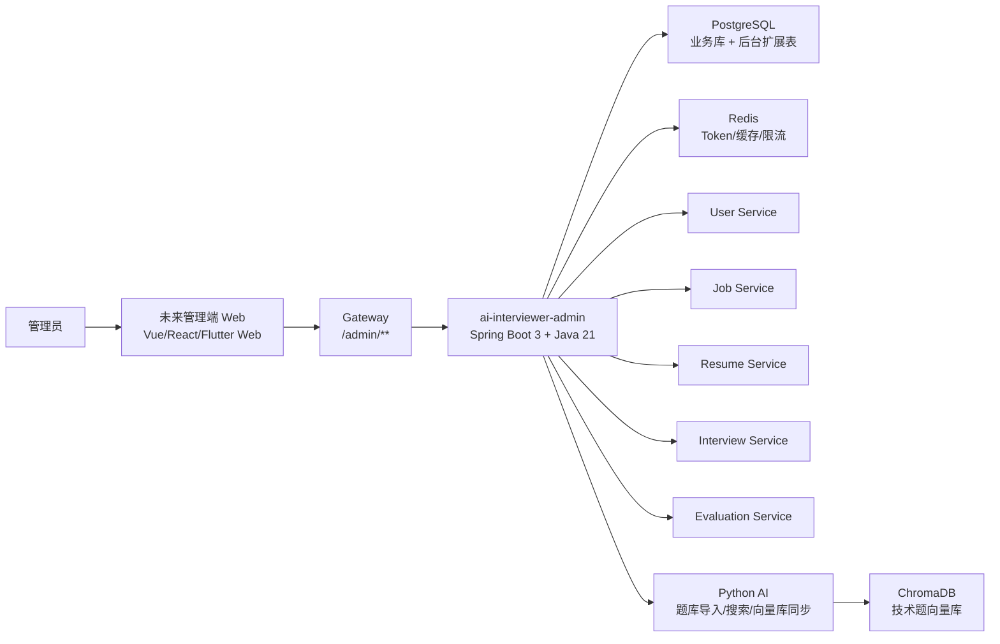
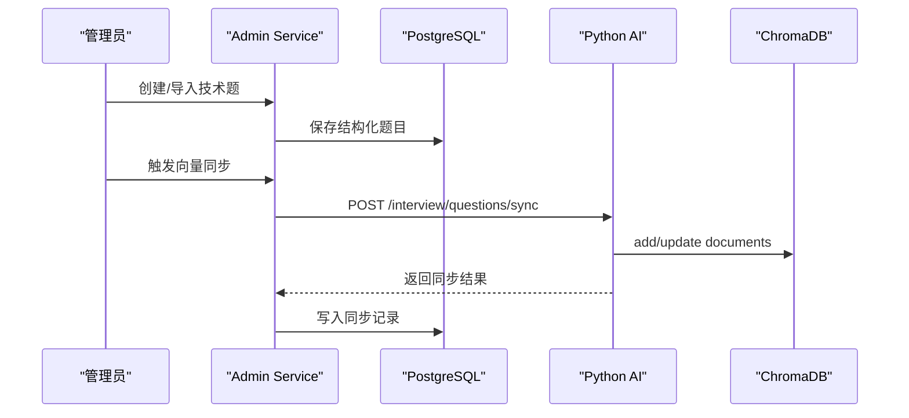

# AI Interviewer 后台管理服务设计文档

## 1. 背景与目标

当前 `my_ai_interviewer` 已包含候选人侧 Flutter 前端、Java 微服务后端、Python AI 服务和基础设施编排，但没有独立管理后台。现有系统已经具备用户、角色、简历、职位、面试会话、评分记录、评估报告、通知等业务数据，适合新增一个独立 Spring Boot 后台管理服务，统一承载管理、运营、诊断和配置能力。

后台服务作为独立项目建设，建议项目名为 `ai_interviewer_admin` 或 `ai-interviewer-admin`。该项目定位为管理聚合服务，不参与候选人实时面试链路，不替代现有业务微服务，而是面向管理员提供统一的后台 API。

## 2. 范围

本设计文档覆盖第一期和第二期内容，一次性规划后台核心能力：

1. 后台登录、管理员权限、菜单权限、接口权限。
2. 总览看板、用户管理、职位管理、简历管理。
3. 面试记录、消息历史、评分记录、评估报告。
4. 技术题库管理，包括结构化题库、题目标签、难度、启停、导入、检索与向量库同步。
5. 系统配置、面试策略配置、通知管理、操作审计。

本设计默认只建设 Spring Boot 管理 API 服务，不包含管理后台 Web 前端实现。后续可用 Vue、React 或 Flutter Web 独立接入这些 API。

## 3. 推荐架构



### 架构原则

1. 后台服务独立部署、独立注册到 Nacos，建议服务名 `ai-interviewer-admin`，端口 `9010`。
2. Gateway 增加 `/admin/**` 路由，所有后台 API 统一从 Gateway 进入。
3. 后台服务可读现有业务库用于聚合查询，写操作优先通过现有业务服务或后台专用领域服务处理。
4. 题库管理采用“结构化题库表 + Python 向量库同步”的组合方案。
5. 管理行为必须有审计日志，关键操作必须可追踪、可回滚或可人工修复。

## 4. 项目结构

```text
ai_interviewer_admin/
├── pom.xml
├── src/main/java/com/aiinterviewer/admin/
│   ├── AdminApplication.java
│   ├── auth/
│   ├── rbac/
│   ├── dashboard/
│   ├── user/
│   ├── resume/
│   ├── job/
│   ├── questionbank/
│   ├── interview/
│   ├── evaluation/
│   ├── notification/
│   ├── systemconfig/
│   ├── audit/
│   └── common/
└── src/main/resources/
    ├── application.yml
    └── mapper/
```

### 技术栈

1. Java 21。
2. Spring Boot 3.3.x。
3. Spring Security + JWT。
4. MyBatis-Plus。
5. PostgreSQL。
6. Redis。
7. Nacos Discovery/Config。
8. OpenAPI/Knife4j。
9. WebClient/OpenFeign，用于调用 Python AI 或现有业务服务。

## 5. 模块规划

### 5.1 `auth` 后台认证

职责：

1. 管理员登录、刷新 Token、退出登录。
2. 校验 `ROLE_ADMIN` 或后台专用角色。
3. 管理后台 Token 黑名单和会话有效期。

建议接口：

1. `POST /admin/auth/login`
2. `POST /admin/auth/refresh`
3. `POST /admin/auth/logout`
4. `GET /admin/auth/me`

### 5.2 `rbac` 权限管理

职责：

1. 管理后台角色。
2. 管理菜单权限和接口权限。
3. 为管理员分配角色。

建议新增表：

```sql
t_admin_menu
t_admin_permission
t_admin_role_permission
t_admin_user_role
```

说明：现有 `t_role/t_user_role` 可继续保留为业务角色。后台权限建议单独建表，避免候选人侧角色和后台权限耦合。

### 5.3 `dashboard` 总览看板

职责：

1. 用户数、职位数、简历数、面试数。
2. 面试完成率、取消率、异常结束数。
3. 平均分、推荐结果分布。
4. 近 7/30 天趋势。
5. 最近异常会话列表。

建议接口：

1. `GET /admin/dashboard/overview`
2. `GET /admin/dashboard/interview-trend`
3. `GET /admin/dashboard/score-distribution`
4. `GET /admin/dashboard/recent-errors`

### 5.4 `user` 用户管理

职责：

1. 用户分页、搜索、详情。
2. 启用、禁用、软删除。
3. 重置密码。
4. 查看用户简历、面试记录、评估报告。
5. 分配后台角色或业务角色。

建议接口：

1. `GET /admin/users`
2. `GET /admin/users/{id}`
3. `PUT /admin/users/{id}/status`
4. `POST /admin/users/{id}/reset-password`
5. `GET /admin/users/{id}/interviews`

### 5.5 `resume` 简历管理

职责：

1. 简历列表、详情、解析状态筛选。
2. 查看原始文本和结构化解析内容。
3. 触发重新解析。
4. 查看简历版本历史。

建议接口：

1. `GET /admin/resumes`
2. `GET /admin/resumes/{id}`
3. `POST /admin/resumes/{id}/reparse`
4. `GET /admin/resumes/{id}/versions`

### 5.6 `job` 职位管理

职责：

1. 职位列表、详情、创建、编辑、上下架。
2. 管理技能标签和职位要求。
3. 管理职位对应的技术题配置。

建议接口：

1. `GET /admin/jobs`
2. `POST /admin/jobs`
3. `PUT /admin/jobs/{id}`
4. `PUT /admin/jobs/{id}/status`
5. `GET /admin/jobs/{id}/question-config`
6. `PUT /admin/jobs/{id}/question-config`

### 5.7 `questionbank` 技术题库管理

职责：

1. 管理结构化技术题。
2. 支持题型、难度、标签、岗位、启停状态。
3. 支持单题创建、批量导入、批量启停。
4. 支持同步到 Python ChromaDB。
5. 支持向量库搜索和结构化条件搜索。

建议新增表：

```sql
t_question_bank
t_question_tag
t_question_tag_relation
t_question_import_batch
t_question_vector_sync_record
```

`t_question_bank` 建议字段：

```text
id
question_text
answer_reference
question_type
difficulty
tags
skill_area
job_id
status
source_type
source_batch_id
vector_sync_status
created_by
created_at
updated_at
deleted_at
```

建议接口：

1. `GET /admin/questions`
2. `POST /admin/questions`
3. `PUT /admin/questions/{id}`
4. `PUT /admin/questions/{id}/status`
5. `POST /admin/questions/import`
6. `POST /admin/questions/vector-sync`
7. `GET /admin/questions/search`
8. `GET /admin/questions/import-batches`

### 5.8 `interview` 面试记录管理

职责：

1. 面试会话分页、搜索、详情。
2. 查看对话消息历史。
3. 查看项目题、技术题、评分记录。
4. 标记异常会话、取消会话。
5. 支持排查技术面试跳过、阶段异常、评分缺失等问题。

建议接口：

1. `GET /admin/interviews`
2. `GET /admin/interviews/{sessionId}`
3. `GET /admin/interviews/{sessionId}/messages`
4. `GET /admin/interviews/{sessionId}/scores`
5. `PUT /admin/interviews/{sessionId}/cancel`
6. `POST /admin/interviews/{sessionId}/diagnose`

### 5.9 `evaluation` 评估报告

职责：

1. 查看评估报告。
2. 按职位、用户、时间、推荐结果筛选。
3. 导出报告。
4. 查看评分维度分布。

建议接口：

1. `GET /admin/evaluations`
2. `GET /admin/evaluations/{sessionId}`
3. `GET /admin/evaluations/statistics`
4. `GET /admin/evaluations/export`

### 5.10 `notification` 通知管理

职责：

1. 通知列表。
2. 发送站内通知。
3. 查看发送状态和失败原因。
4. 管理通知模板。

建议新增表：

```sql
t_notification_template
```

建议接口：

1. `GET /admin/notifications`
2. `POST /admin/notifications/send`
3. `GET /admin/notifications/templates`
4. `POST /admin/notifications/templates`
5. `PUT /admin/notifications/templates/{id}`

### 5.11 `systemconfig` 系统配置

职责：

1. 管理面试策略配置。
2. 管理技术题默认类型、默认数量、难度比例。
3. 管理 AI 服务地址和题库同步开关。
4. 管理模型参数的展示和只读校验，密钥不在后台明文展示。

建议新增表：

```sql
t_system_config
t_interview_strategy_config
```

建议接口：

1. `GET /admin/configs`
2. `PUT /admin/configs/{key}`
3. `GET /admin/interview-strategies`
4. `PUT /admin/interview-strategies/{id}`

### 5.12 `audit` 操作审计

职责：

1. 记录管理员操作。
2. 记录操作对象、操作前后摘要、IP、User-Agent。
3. 支持按用户、模块、操作类型、时间筛选。

建议新增表：

```sql
t_admin_operation_log
```

关键字段：

```text
id
admin_user_id
module
operation
target_type
target_id
request_uri
request_method
before_snapshot
after_snapshot
ip
user_agent
result
error_message
created_at
```

## 6. 数据集成设计

### 6.1 复用现有表

后台直接读取以下业务表做管理查询：

1. `t_user`
2. `t_role`
3. `t_user_role`
4. `t_resume`
5. `t_resume_version`
6. `t_job`
7. `t_job_question`
8. `t_interview_session`
9. `t_interview_message`
10. `t_score_record`
11. `t_evaluation`
12. `t_notification`

### 6.2 新增后台表

后台需要新增以下表：

1. `t_admin_menu`
2. `t_admin_permission`
3. `t_admin_role_permission`
4. `t_admin_user_role`
5. `t_question_bank`
6. `t_question_tag`
7. `t_question_tag_relation`
8. `t_question_import_batch`
9. `t_question_vector_sync_record`
10. `t_notification_template`
11. `t_system_config`
12. `t_interview_strategy_config`
13. `t_admin_operation_log`

## 7. 技术题库设计

当前技术题库是 Python 侧非结构化文档分片向量库。后台第二期一起做时，建议升级为“结构化题库 + 向量库同步”：

1. 管理员在后台维护结构化题目。
2. 题目保存到 PostgreSQL `t_question_bank`。
3. 后台触发同步任务，将启用状态的题目同步到 Python AI 服务。
4. Python AI 服务写入 ChromaDB，用于面试时 RAG 检索。
5. 每次同步记录写入 `t_question_vector_sync_record`。



## 8. 权限与安全

1. 后台接口必须要求管理员登录。
2. 默认只允许 `ROLE_ADMIN` 访问后台。
3. 后台新增细粒度权限，控制菜单和接口。
4. 密钥类配置不允许明文展示，只展示是否已配置。
5. 危险操作需要审计，包括禁用用户、删除职位、取消面试、批量导入题库、同步向量库。
6. 后台接口建议增加限流，避免批量导入和报表查询影响线上面试。

## 9. 错误处理与诊断

1. 统一返回 `Result<T>`，保持与现有 Java 后端风格一致。
2. 后台服务区分业务错误、权限错误、外部服务错误、数据同步错误。
3. 题库同步失败时不影响结构化题库保存，但状态应标记为同步失败。
4. 面试诊断接口应输出阶段、最后问题、技术题池、评分记录数量、消息数量等关键字段。

## 10. 验收标准

### 第一批能力

1. 管理员可登录后台 API。
2. 可查看看板统计。
3. 可管理用户、职位、简历。
4. 可查看面试会话、消息、评分、评估报告。
5. 所有管理操作写入审计日志。

### 第二批能力

1. 可维护结构化技术题库。
2. 可按题型、难度、标签、状态检索题目。
3. 可批量导入题目。
4. 可同步启用题目到 Python 向量库。
5. 可查看题库导入批次和向量同步记录。
6. 可配置默认技术题类型、数量、难度比例。

## 11. 实施顺序

建议按以下顺序实施：

1. 搭建 `ai-interviewer-admin` 独立 Spring Boot 项目。
2. 接入 Nacos、Gateway、PostgreSQL、Redis。
3. 实现后台登录、管理员鉴权和审计基础设施。
4. 实现 dashboard、user、job、resume、interview、evaluation 查询能力。
5. 实现 questionbank 结构化题库表和 CRUD。
6. 实现题库批量导入和向量同步。
7. 实现 systemconfig 和 interview strategy 配置。
8. 补充接口文档、联调脚本和基础测试。

## 12. 非目标

1. 不在本项目中实现管理后台 Web 页面。
2. 不改造候选人侧 Flutter 面试流程。
3. 不把实时面试 SSE 链路迁移到后台服务。
4. 不在后台明文管理生产密钥。
