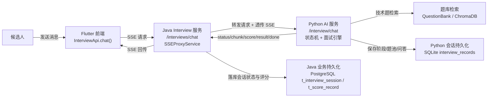
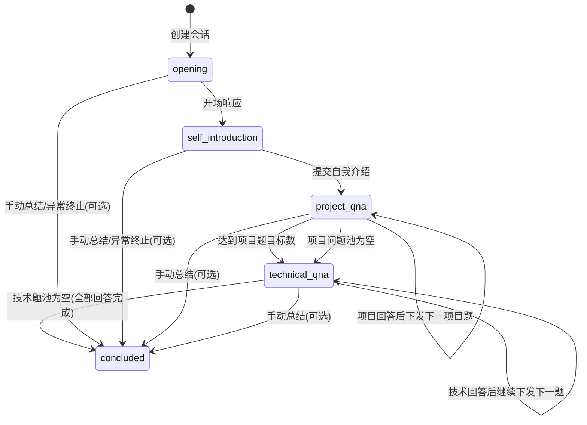
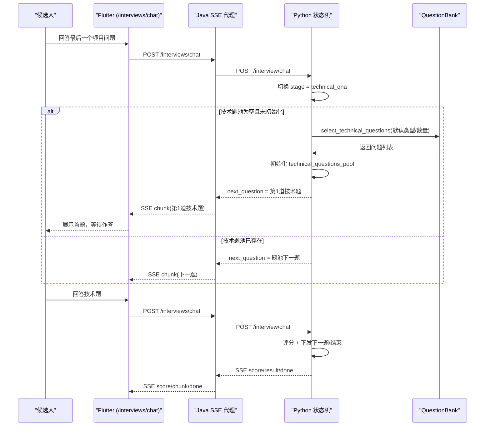

# AI Interviewer 架构设计文档

本文档是 `my_ai_interviewer` 的项目级架构设计文档，重点覆盖当前面试链路，尤其是技术问题面试环节的运行方式与推荐改造方案。

## 1. 总览架构图

### 设计要点

1. 前端通过统一接口 `/interviews/chat` 交互，不直接感知具体阶段 API。
2. Java `interview` 服务承担会话归属校验、SSE 代理、评分与消息持久化。
3. Python 服务是面试状态机与题目生成/评估核心。
4. 评分与会话在 Java 侧持久化用于业务查询；Python 侧保留面试上下文与问题池。

## 2. 面试状态机图

### 状态说明

1. `opening`：系统开场阶段。
2. `self_introduction`：候选人自我介绍阶段。
3. `project_qna`：项目问答阶段，可出现追问循环。
4. `technical_qna`：技术问答阶段，按题池推进。
5. `concluded`：面试结束阶段。

## 3. 推荐改造时序图（技术题首题自动初始化）

目标：在进入 `technical_qna` 时，自动初始化并下发第一道技术题，避免“先进入技术阶段，但下一条用户消息被误当作技术题回答”。

## 4. 推荐改造的实施原则

1. 保持前端仍使用统一 `/interviews/chat`，不引入前端阶段分支复杂度。
2. 将“技术题首题初始化”收敛到 Python 状态机内部，保证单一事实来源。
3. `start-technical` 可保留为兼容接口，但统一链路应不依赖它才能正常推进。
4. 对 `technical_qna` 增加兜底校验：若未初始化题池则先初始化，不直接结束。

## 5. 验收标准

1. 项目问答结束后，系统直接下发第 1 道技术题，不再只返回过渡提示语。
2. 候选人发送“好的/继续”等确认词不会被记为技术题答案。
3. 技术题数量与评分记录一致，面试在题池真正耗尽后结束。
4. 恢复会话后，能够继续当前技术题流程，不出现阶段跳跃。
