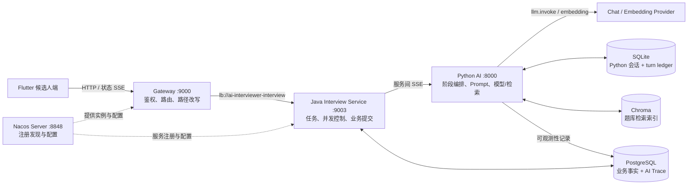
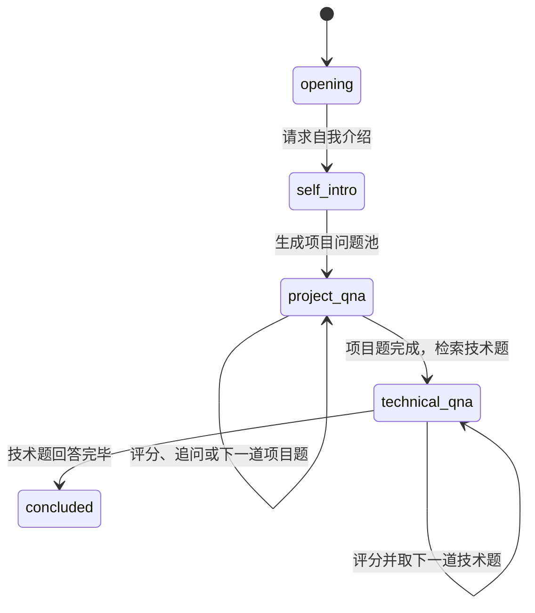
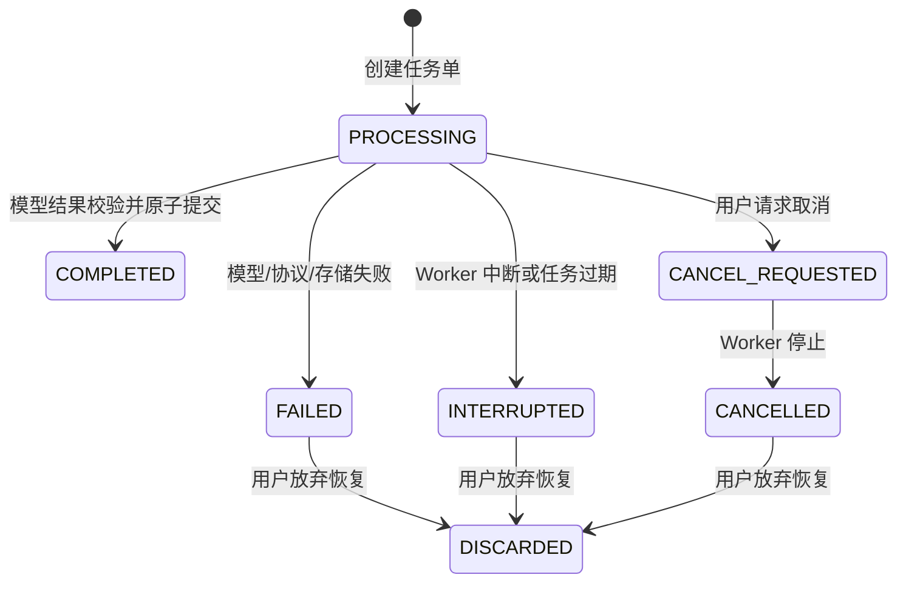
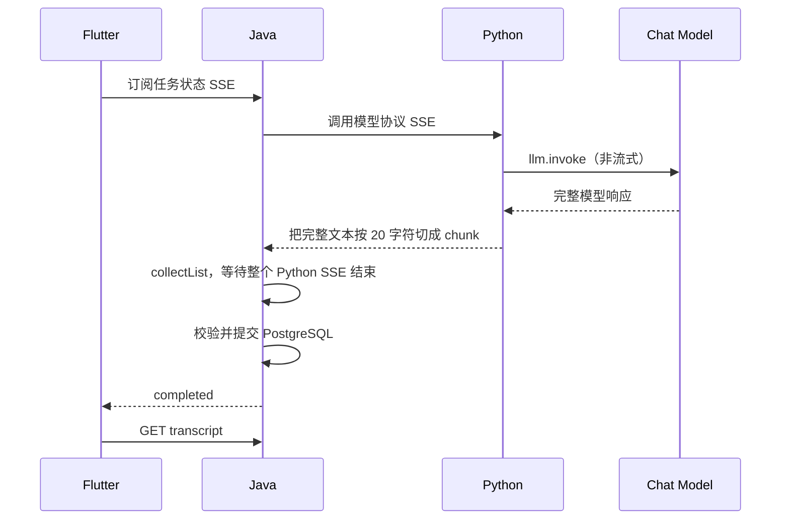
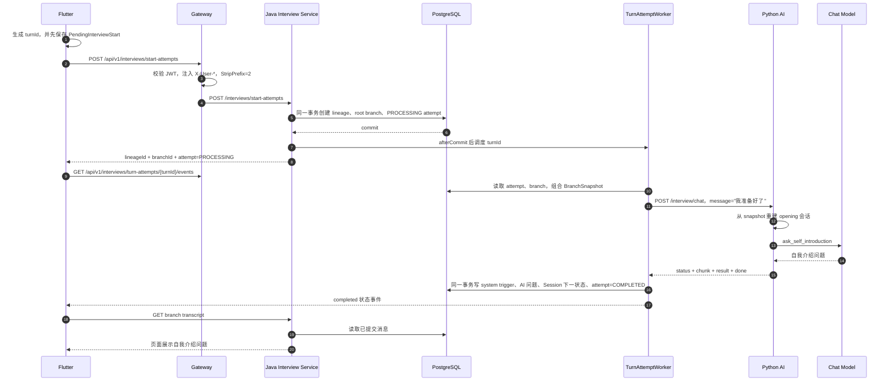
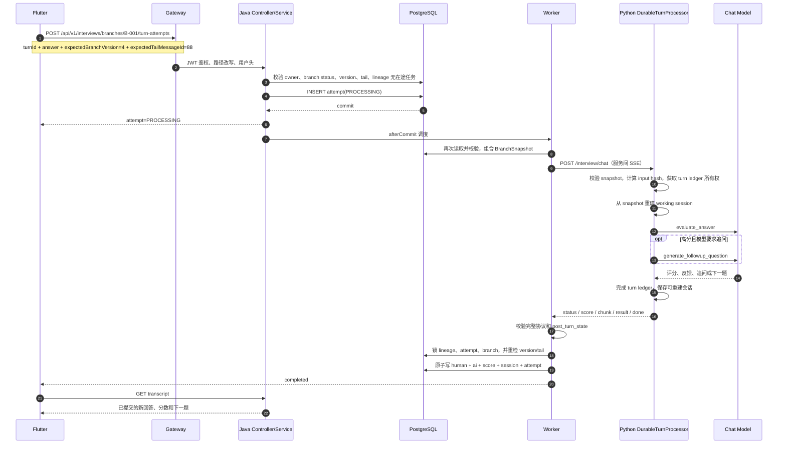
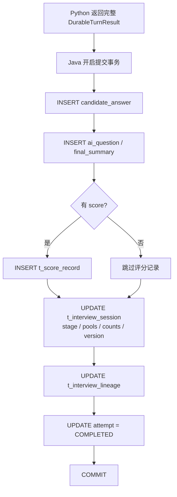

# FDE Day 2 — 一轮 AI 面试到底怎样跑完

> **文档性质：静态源码基线，不是运行报告**<br>
> **审计日期：2026-08-05**<br>
> **代码版本：`d1de1521b4d5`**<br>
> **主线：Flutter → Gateway → Java durable Turn Attempt → Python AI → 模型/题库 → Java 原子提交 → Flutter 回读**

这份文档回答的不是“项目里有哪些类”，而是一个更具体的问题：

> 候选人在 App 里点击开始，或者回答一道题之后，这个请求经过了谁、每一层做了什么、模型在哪里被调用、结果在哪里落地、断网或并发时为什么不会轻易把面试历史写乱？

Day 2 学习计划要求：画完整请求链、列出模型调用点、列出持久化点。本文把三件事串进同一段业务故事里，避免把它们拆成互不相干的清单。

## 先看结论

当前面试主链路可以浓缩成 8 句话：

1. Flutter 不直接调用 Python，也不直接调用 Java 业务端口，只访问 Gateway。
2. Gateway 验证 JWT，把外部路径改写成 Java Controller 路径，再通过 Nacos 中的服务实例完成转发。
3. Java 收到“开始面试”或“提交答案”后，先在 PostgreSQL 创建一个 `PROCESSING` 的 **Turn Attempt**，随后立即响应 Flutter。
4. 数据库事务提交成功后，Java 才把这个 Turn Attempt 交给后台 Worker；因此模型任务不依赖 Flutter 的 SSE 连接是否还活着。
5. Worker 从 PostgreSQL 组合一份稳定的 **Branch Snapshot**，再通过服务间 SSE 调用 Python `/interview/chat`。
6. Python 根据当前面试阶段重建会话，执行一次或多次模型/题库调用，返回 `status / score / question / chunk / result / done`。
7. Java 不会收到一点内容就写一点数据库；它等 Python 协议完整结束并通过校验后，在一个 PostgreSQL 事务里提交候选人消息、AI 消息、评分、会话状态和 Turn Attempt 终态。
8. Flutter 收到的只是 Turn Attempt 状态 SSE。收到 `COMPLETED` 后，它重新读取 transcript，页面展示的是 PostgreSQL 已提交的业务事实。

对你来说，Controller → Service → Repository 不是 Day 2 最值得学的部分。你已有 12 年 Java 后端经验，真正需要补的是：**怎样把不稳定、慢、可能输出坏格式的 AI 调用，包在一个可恢复、可审计、可验证的业务事务外面。**

## 一、先建立 5 个概念

### 1. Lineage：一场面试的“家族”

一场面试可能从历史消息处分叉，形成不同回答路线。`lineage` 表示这些分支共同属于哪一场面试。

### 2. Branch / Interview Session：当前选择的一条回答路线

`branch` 是候选人正在看的那条面试路径。根分支和后续分支都由 `t_interview_session` 保存。

### 3. Message：已经确认的业务消息

只有成功提交的候选人回答和 AI 问题，才进入 `t_interview_message`。页面回放以这些消息为准，不以 Flutter 内存或 Python 临时会话为准。

### 4. Turn Attempt：处理“一轮对话”的任务单

一次“我回答了问题，请 AI 评分并给出下一题”不是普通同步 HTTP 请求，而是一张任务单：

```text
turnId + 当前 branch 版本 + 当前尾消息 + 候选人回答 + 处理状态
```

它先被保存为 `PROCESSING`，成功后变成 `COMPLETED`，失败则进入 `FAILED / INTERRUPTED / CANCELLED` 等状态。

一个容易理解的类比是：

```text
候选人提交答案     = 到柜台下单
Turn Attempt       = 可查询、可重试的订单号
后台 Worker         = 后厨
模型调用            = 后厨中最慢、最不稳定的加工环节
PostgreSQL 原子提交 = 整份菜做好后一起出餐
Flutter 状态 SSE    = 叫号屏，只告诉你“处理中/已完成”
Transcript API     = 真正取餐，不从叫号屏读取菜品内容
```

### 5. Branch Snapshot：交给 Python 的事实快照

Python 不被允许只相信自己的本地会话。每一轮开始时，Java 都从 PostgreSQL 组合当前分支的消息、评分、阶段、题池和计数，形成 `BranchSnapshot`。Python 用它重建本轮工作会话。

这明确了权威边界：

```text
Java / PostgreSQL：已经提交的面试业务事实
Python：根据事实快照计算“下一状态”
Java：校验下一状态，再决定是否提交
```

## 二、系统全景：谁在数据链路上，谁不在



这里最容易误解的是 Nacos：

- Nacos 是控制面，保存服务注册信息和配置。
- 正常业务数据不会走 `Flutter → Gateway → Nacos → Java`。
- 实际数据面是 `Flutter → Gateway → Java`；Gateway 内的 Nacos Client 已经拿到了可用实例，Spring Cloud LoadBalancer 再选择实例。

## 三、不要混淆两套状态机

系统同时存在“面试进行到哪一步”和“这一轮任务处理到哪一步”，它们不是同一件事。

### 1. 面试阶段状态机



这套状态保存在面试 Session 中，决定 Python 下一轮执行哪段业务逻辑。

### 2. Turn Attempt 任务状态机



同一个 `project_qna` 面试阶段可以经历很多个 Turn Attempt。一个 Turn Attempt 失败，不代表整场面试已经结束。

## 四、两条 SSE：名字相同，职责不同

### SSE A：Flutter ↔ Java，传任务状态

路径：

```text
GET /api/v1/interviews/turn-attempts/{turnId}/events
```

主要事件：

```text
created / processing / completed / failed / interrupted / cancelled
```

它的作用是告诉页面“任务现在是什么状态”，不传模型生成的 token。

### SSE B：Java ↔ Python，传模型处理协议

路径：

```text
POST {python.ai.base-url}/interview/chat
```

协议事件：

```text
status → score? → question? → chunk* → result → done
```

其中：

- `chunk` 拼出完整 AI 消息；
- `result` 给出 `next_stage` 和权威 `post_turn_state`；
- `done` 再次确认最终阶段和面试是否结束；
- Java 要求 `result`、`done` 都存在且相互一致。

### 当前真实行为



因此当前 durable 主链路是“后台任务 + 完成后回读”，不是“模型 token 边生成边显示到 Flutter”。这不一定是错误，但必须在做 TTFT、流式体验和延迟基线时如实描述。

## 五、场景一：候选人点击“开始面试”

### 业务目标

用户选择简历和岗位后点击开始。系统需要创建一场新面试，并给出第一句“请做自我介绍”。即使用户重复点击、请求超时重发或刚发完请求就断网，也不能创建两场不同面试。

### 完整时序



### 第 1 步：Flutter 先保存稳定的 `turnId`

`InterviewService.startNewInterview()` 会：

1. 检查是否已有相同启动请求正在进行；
2. 从 `PendingStartStore` 恢复未完成的启动请求，或者生成新的 `turnId`；
3. 先把 `turnId + resumeId + jobId` 写入 SharedPreferences；
4. 请求成功后才清除本地 pending 记录。

如果第一次 HTTP 响应丢失，Flutter 可以复用同一个 `turnId` 重发，而不是生成另一个新面试。

请求示意：

```http
POST /api/v1/interviews/start-attempts
Authorization: Bearer <redacted>
Content-Type: application/json

{
  "turnId": "T-start-001",
  "resumeId": 101,
  "jobId": 202
}
```

### 第 2 步：Gateway 做鉴权、找服务、改路径

Gateway 的面试路由是：

```text
Path=/api/v1/interviews/**
uri=lb://ai-interviewer-interview
StripPrefix=2
```

所以：

```text
外部：POST /api/v1/interviews/start-attempts
内部：POST /interviews/start-attempts
```

`AuthGlobalFilter` 验证 Bearer JWT 后注入：

```text
X-User-Id
X-User-Name
X-User-Roles
```

Controller 使用 `X-User-Id` 判断简历、lineage 和 branch 的所有权。下游服务端口如果被直接暴露，攻击者可能伪造这些头，因此生产网络必须保证业务服务只信任来自 Gateway 的流量。

### 第 3 步：Java 先创建可恢复任务，再调用模型

`StartAttemptService.create()` 在事务里完成：

- 校验 `turnId`；
- 确认简历属于当前用户；
- 确认岗位有效；
- 由 `turnId` 计算稳定的 root ID；
- 创建 lineage；
- 创建 root branch；
- 创建 `PROCESSING` Turn Attempt；
- 把候选人输入设为系统触发语 `我准备好了`。

只有数据库 commit 成功后，`scheduleAfterCommit()` 才调用 Worker。这个细节很重要：如果在事务提交前就启动 Worker，Worker 可能查不到刚创建的数据，或者模型成功后发现事务已经回滚。

### 第 4 步：Python 在 `opening` 阶段只做一件事

Python 看到 snapshot 的阶段是 `opening`，执行：

```text
DurableTurnProcessor
  → reconstruct_session_from_snapshot
  → InterviewService.handle_opening_response
  → Interviewer.ask_self_introduction
  → invoke_observable
  → llm.invoke
```

这一轮不会先调用 `generate_opening`。当前 durable 启动链直接用系统触发语进入“请求自我介绍”环节。

### 第 5 步：Java 一次性提交完整结果

`TurnCommitService.commit()` 在一个 PostgreSQL 事务里：

- 写入一条 human 消息，内容为 `我准备好了`，类型为 `system_trigger`；
- 写入一条 AI 消息，即自我介绍问题；
- 把 Session 阶段从 `opening` 更新到 `self_intro`；
- 保存 Python 返回的权威阶段、题池和计数；
- `branch_version + 1`；
- 把 Turn Attempt 更新为 `COMPLETED`。

任一步抛异常，整个事务回滚，不会留下“AI 消息写了但 Attempt 还在 PROCESSING”这种半成功业务状态。

## 六、场景二：候选人回答一道项目题

这是最能代表完整 AI 请求生命周期的一轮。

假设当前事实是：

```text
branchId              = B-001
stage                 = project_qna
branchVersion         = 4
tailMessageId         = 88（当前 AI 问题）
candidateAnswer       = “我用 Redis Lua 保证库存扣减原子性……”
```

### 完整时序



### Flutter 提交的不是只有答案

```json
{
  "turnId": "T-answer-005",
  "candidateAnswer": "我用 Redis Lua 保证库存扣减原子性……",
  "expectedBranchVersion": 4,
  "expectedTailMessageId": 88
}
```

两个 `expected*` 字段表达的是：

> 我是在“branch 第 4 版、最后一条消息是 88”这个上下文里回答的。如果服务器已经不是这个状态，请拒绝，不要把答案硬接到另一道题后面。

这比只传 `sessionId + answer` 安全，因为用户可能同时打开两个页面、切换分支，或者在网络重试期间 branch 已被另一轮修改。

### Java 创建阶段的 5 道门

`TurnAttemptService.createInternal()` 依次检查：

1. branch 属于当前用户；
2. branch 仍然是 active；
3. `branchVersion` 与客户端预期一致；
4. 当前尾消息与客户端看到的一致；
5. 同一个 lineage 没有另一条正在处理的 Turn Attempt。

通过后只插入 Turn Attempt，不提前插入候选人消息。原因是模型还可能失败；候选人消息和 AI 回答应作为一轮完整业务结果一起提交。

### Worker 为什么还要再次检查

创建任务和真正开始模型处理之间可能有排队时间。Worker 通过 `BranchSnapshotComposer` 再次检查：

- 用户所有权；
- lineage 是否变化；
- branch 是否 active；
- branch version；
- tail message；
- transcript 中只包含 `delivery_status=completed` 的消息。

然后把祖先分支消息、当前分支增量、历史评分、题池和阶段组合成不可随意猜测的输入快照。

### Python 不是继续使用旧内存对象

`DurableTurnProcessor` 会：

1. 用 Pydantic 校验 `BranchSnapshot`；
2. 确认 snapshot 内的 `turn_id` 与请求一致；
3. 对 `candidate_answer + canonical snapshot` 计算 SHA-256；
4. 在 SQLite `turn_ledger` 里获取本轮处理所有权；
5. 从 snapshot 重建一个 working session；
6. 只在 working session 上执行阶段逻辑；
7. 成功后保存结果和可重建会话；
8. 返回完整 `DurableTurnResult`。

因此 Python 本地会话丢失时，Java 的业务历史仍可重新构造下一轮输入。

### 一道项目题可能触发几次模型调用

```text
必定调用：evaluate_answer
条件调用：generate_followup_question
可能不再调用模型：直接从已生成的项目问题池取下一题
阶段切换时：从 Chroma 检索技术题，触发 query embedding，但不是 Chat LLM
```

这说明“一轮用户回答”不等于“一次模型调用”。做延迟和成本基线时，必须按 `turnId → 多个 llm_call` 聚合。

### Java 最后的原子提交

模型完成后，`TurnCommitService` 按固定锁顺序锁定 lineage、attempt 和 branch，再重新检查所有权、状态、版本和尾消息。校验通过后在同一事务内：

1. 写候选人回答；
2. 写 AI 反馈/下一题；
3. 有分数时写 `t_score_record`；
4. 更新面试阶段、题池、计数、Python session ID；
5. `branch_version + 1`；
6. 更新 lineage 最近业务活动时间；
7. 把 attempt 标记为 `COMPLETED`。

模型调用发生在事务外，避免拿着数据库锁等待几十秒；最终提交才进入短事务。这是这条链路最重要的工程取舍之一。

## 七、场景三：SSE 断开、刷新页面或服务中断

### 1. Flutter 状态 SSE 断了

模型任务不会因为 Flutter 断开而自动取消。Flutter 的处理顺序是：

```text
状态 SSE 异常
  → GET /turn-attempts/{turnId} 查询数据库状态
  → 如果已终态，按终态处理
  → 如果仍 PROCESSING，按延迟表重新连接 SSE
  → 收到 COMPLETED 后刷新 transcript
```

### 2. Flutter 在完成事件到达后刷新失败

它会重试 `refreshReplay()`。只有 transcript 读成功，页面才获得新消息。`COMPLETED` 是“可以去数据库取结果了”，不是结果本身。

### 3. Java 进程在 Worker 处理中重启

后台线程本身在内存中，进程重启后不会原地续跑。`TurnAttemptRecoveryScheduler` 默认每分钟扫描一次；持续 `PROCESSING` 超过 15 分钟的任务会标记为 `INTERRUPTED`，供用户重试或丢弃。

这叫“可恢复失败”，不是“自动从模型调用中点续传”。

### 4. Python 收到重复的 `turnId`

Python `turn_ledger` 有三种行为：

- 相同 `turnId`、相同输入、已经完成：直接回放已保存结果，不再重复调用模型；
- 相同 `turnId`、不同输入：拒绝，避免幂等键被复用；
- 相同输入仍在处理：返回 processing conflict；超过租约时间后允许 compare-and-swap 接管。

### 5. 为什么状态 SSE 的正确性不依赖内存事件

`TurnAttemptEventPublisher` 是内存组件，不是消息队列。但 `TurnAttemptService.events()` 会：

1. 先读取数据库状态；
2. 非终态才订阅内存流；
3. 订阅后再次读数据库，补上“刚好在订阅期间完成”的竞态；
4. 每次连接先发送一个数据库状态快照；
5. 已终态时直接返回终态快照。

所以内存事件负责低延迟通知，PostgreSQL 状态负责最终判断。

## 八、Python 内部到底怎样决定下一步

### 阶段与计算路径

|进入 Python 时的阶段|本轮业务动作|Chat 模型调用|其他 AI 调用|下一阶段|
|---|---|---|---|---|
|`opening`|请求候选人自我介绍|`ask_self_introduction`|无|`self_intro`|
|`self_intro`|记录自我介绍，一次生成整个项目问题池|`generate_project_questions`|无|`project_qna`|
|`project_qna`|评分；必要时追问，否则从项目题池取下一题|`evaluate_answer`；条件触发 `generate_followup_question`|项目题结束时检索技术题，可能触发 query embedding|`project_qna` 或 `technical_qna`|
|`technical_qna`|评分并从技术题池取下一题|`evaluate_answer`|题池通常已在阶段切换时检索|`technical_qna` 或 `concluded`|
|`concluded`|返回“当前面试已结束”|无|无|`concluded`|

### 所有 Chat 调用点

所有生产 Chat SDK 调用最终集中到：

```text
Interviewer 的业务方法
  → invoke_observable(..., call_type=...)
  → prompt.invoke(input_values)
  → llm.invoke(prompt_value)
  → 记录模型、token、延迟、错误和可选原始 payload
```

|`call_type`|用途|当前 durable 主链是否使用|
|---|---|---|
|`ask_self_introduction`|生成自我介绍请求|是，启动轮|
|`generate_project_questions`|根据简历/JD 一次生成项目问题池|是，自我介绍轮|
|`evaluate_answer`|输出分数、反馈和追问判断|是，项目题和技术题|
|`generate_followup_question`|根据回答漏洞生成追问|条件使用|
|`generate_opening`|生成开场白|`start_interview()`/旧流程使用；durable 启动轮不走它|
|`conclude_interview`|模型生成最终总结|独立/兼容结论流程可用；当前 durable 技术题耗尽时没有自动调用它|
|`ask`|通用对话兜底|兼容调用，不是 durable 主流程|

模型客户端由 `build_chat_llm()` 创建。未显式指定模型且主备模型不同的时候，会配置 fallback；这意味着一次业务调用在主模型失败后可能请求备用模型，不能只按业务方法数估算供应商请求数。

### Embedding 与 Chroma 调用

题库不是每一轮都重新向 Chat 模型出题。技术题可通过 `QuestionBank` 检索：

```text
岗位要求 + 题型 + 历史平均分
  → query embedding
  → Chroma similarity search
  → 本地关键词召回
  → RRF 合并
  → 结构化技术题池
```

另外，题库导入、Admin 结构化题目同步会触发 document embedding 并写入 Chroma。

## 九、持久化地图：每份数据由谁负责

|存储|保存什么|谁写入|是否业务权威|
|---|---|---|---|
|PostgreSQL 面试表|lineage、branch/session、message、score、turn attempt、evaluation|Java 服务|是，面试业务事实来源|
|PostgreSQL 其他业务表|用户、角色、简历元数据、职位、通知、Admin 配置/题库/审计|各 Java 服务|是|
|PostgreSQL AI 可观测表|`t_ai_trace`、`t_ai_trace_step`、`t_ai_llm_call`、访问审计|Python observability；Admin 读取|是，Trace/成本/延迟证据；是否记录原文受配置限制|
|MinIO|简历原始文件字节|Resume Service|是，文件内容来源；PostgreSQL 只保存元数据/定位|
|SQLite `interviews.db`|Python session、`turn_ledger`|Python|可重建运行态；不是最终面试历史|
|可选 LangGraph SQLite checkpoint|agent run 开始/结束状态|Python|诊断/恢复辅助，不替代业务历史|
|Chroma|题库文本、metadata、向量索引|Python QuestionBank|可重建检索索引|
|Redis|`auth:blacklist:{token}` + TTL|User Service|短期 token 撤销状态|
|Flutter SharedPreferences|access/refresh token、待启动请求|Flutter|客户端会话与重试辅助|
|Nacos|服务注册、发现与配置|Java 服务/Nacos Client|不是面试业务存储|

### 一轮项目回答成功后的写入



### 为什么 Python SQLite 不是最终真相

同一轮在 Python 成功、Java 提交失败时，Python ledger 可能已经有结果，但 PostgreSQL 没有业务消息。下次 Java 用相同 `turnId + snapshot + answer` 重试时，Python可以回放相同结果，Java 再尝试提交。最终页面仍以 Java PostgreSQL 的 commit 为准。

## 十、这套实现真正难和精妙的地方

### 1. 把用户连接与模型任务解耦

普通 SSE 代理常见问题是：页面关闭，HTTP 连接取消，模型任务也被取消，系统不知道这轮回答到底算不算成功。

这里先持久化 Turn Attempt，再异步执行；客户端只是观察任务。这是从“聊天接口”升级为“可靠业务任务”的关键。

### 2. `afterCommit` 才调度 Worker

这是一个很小但很专业的事务细节。它保证 Worker 永远不会处理尚未提交或最终回滚的任务单。

### 3. 三层幂等，而不是只靠一个 UUID

```text
Flutter：失败重发时复用 pending turnId
Java：turnId 相同且 payload 相同则 replay；不同则 conflict
Python：turnId + input hash 控制模型计算 replay/冲突/接管
```

三层分别解决客户端重试、业务任务重复和模型重复执行，职责不同。

### 4. Snapshot 让 Python 变成可替换的计算节点

Python 不需要永久持有唯一会话状态。Java 每轮发完整且版本化的 snapshot，Python可以重建会话。这比依赖某台 Python 实例内存更适合未来横向扩容和故障恢复。

### 5. 乐观并发 + 提交时加锁

创建任务时用 `branchVersion + tailMessageId` 做乐观检查，减少长时间持锁；模型结束后用固定顺序锁和再次校验保护最终提交。

这解决的是 AI 系统特有问题：模型调用可能很慢，不能在模型等待期间一直锁数据库，但又不能让旧上下文的结果覆盖新分支。

### 6. 把 SSE 当协议，而不是“收到字符串就算成功”

`WebClientTurnModelClient` 明确拒绝：

- 没有 `result` 或 `done`；
- 重复/非法的 `result` 或 `done`；
- `done` 后还有事件；
- `result.next_stage` 与 `done.stage` 不一致；
- `concluded` 与 `is_interview_complete` 不一致；
- durable 请求缺少 `post_turn_state`。

网络连接正常关闭不代表业务成功。只有协议闭合才允许提交。

### 7. Python 返回“权威下一状态”，Java仍做二次校验

Python 返回阶段、branch 状态、项目题计数、题池、追问计数等 `post_turn_state`；Java 检查非负值、阶段一致性和 completed 语义，再写入 PostgreSQL。

这比 Java 根据一个 `nextStage` 猜测 Python 内部发生了什么更稳，也避免两端各自演算后逐渐漂移。

### 8. 完成事件和业务结果分离

状态 SSE 不承载完整消息。Flutter 收到 `COMPLETED` 后再 GET transcript，确保页面展示的是已经提交、可以回放的结果。它牺牲了一点即时性，换来了更清晰的事实边界。

## 十一、当前实现的限制和风险

这些不是为了否定设计，而是 Day 3 运行验证和后续演进必须知道的边界。

### 1. 当前并不是真正的模型 token streaming

`llm.invoke()` 等待完整回答；Python 再按每 20 个字符切 `chunk`；Java 又用 `collectList().block()` 等整个 SSE 完成。现在的 chunk 是协议分片，不会降低模型首 token 延迟，也不会实时送到 Flutter。

### 2. Java Worker 和事件发布器是单进程内存组件

进程重启会丢失正在执行的线程和内存订阅。恢复调度器会把超时任务标成 `INTERRUPTED`，但不会自动从模型中间位置续跑。若要多实例和自动接管，未来需要数据库领取任务或消息队列等更强机制。

### 3. Python ledger 是本地 SQLite

它适合单机开发和当前基线，但多个 Python 实例如果不共享同一 SQLite 文件，不能天然共享幂等记录。扩容前需要重新设计 ledger 存储和租约语义。

### 4. 评分 JSON 解析失败会退回 70 分

`evaluate_answer()` 在找不到合法 JSON 或解析异常时可能返回默认 70 分与通用反馈。这会把模型格式错误伪装成正常中等分，污染质量基线。Day 3 应把它作为明确失败模式，而不是只统计 HTTP 成功率。

### 5. durable 结束流程没有自动调用模型总结

当前技术题池耗尽时，`handle_technical_answer()` 把阶段设为 `concluded` 并返回固定结束消息；`conclude_interview()` 的模型总结是另一个可调用点。若产品期望最终 AI 总结，需要先明确协议和业务入口，不能从函数存在推断主链已经执行。

### 6. 新旧链路并存会增加排障歧义

代码仍保留旧的 `POST /interviews/chat` 直通 SSE 入口和 `SSEProxyService`。看到该接口可用，不代表 Flutter 当前主流程正在用它。日志、压测和 Trace 必须按 `entrypoint=turn_attempt` 或具体 endpoint 区分。

### 7. Gateway 身份头是网络信任边界

下游 Controller 直接读取 `X-User-Id`。如果 9001～9006 端口对不可信网络开放，Gateway 鉴权可以被绕过。部署验证必须检查网络暴露，不只检查 Java 代码。

## 十二、旧直通 SSE 链路为什么不是本文主线

兼容链路是：

```text
Flutter/调用方
  → POST /api/v1/interviews/chat
  → Gateway
  → Java InterviewController
  → SSEProxyService
  → Python /interview/chat
  → Java 旧持久化逻辑
  → 调用方直接收到内容 SSE
```

当前 Flutter `sendMessage()` 已委托给 `submitTail()`，实际调用 branch Turn Attempt 接口。两条链路的核心差异是：

|维度|durable Turn Attempt 主链|旧直通 SSE|
|---|---|---|
|客户端连接断开|后台任务可继续|容易与代理连接生命周期耦合|
|客户端看到的 SSE|任务状态|模型内容|
|幂等任务记录|有 `t_interview_turn_attempt`|不是同一套 durable 语义|
|结果读取|完成后回读 transcript|边流式边消费|
|当前 Flutter 正常路径|是|否，兼容保留|

## 十三、关键源码导航

### Flutter

- [`api_client.dart`](../ai_interviewer_front/lib/api/api_client.dart)：Gateway 基址、`/api/v1` 前缀、Bearer token 和 401 refresh。
- [`interview_api.dart`](../ai_interviewer_front/lib/api/interview_api.dart)：start、create attempt、状态 SSE、retry/cancel/discard、transcript API。
- [`interview_service.dart`](../ai_interviewer_front/lib/services/interview_service.dart)：pending start、提交答案、SSE 重连、终态后刷新回放。

### Gateway / Java

- [`Gateway application.yml`](../ai_interview_backend/ai-interviewer-gateway/src/main/resources/application.yml)：`Path`、`lb://`、`StripPrefix=2`、SSE timeout。
- [`AuthGlobalFilter.java`](../ai_interview_backend/ai-interviewer-gateway/src/main/java/com/aiinterviewer/gateway/filter/AuthGlobalFilter.java)：JWT 校验和 `X-User-*` 注入。
- [`StartAttemptService.java`](../ai_interview_backend/ai-interviewer-interview/src/main/java/com/aiinterviewer/interview/service/StartAttemptService.java)：幂等创建根 lineage/branch/attempt，commit 后调度。
- [`TurnAttemptService.java`](../ai_interview_backend/ai-interviewer-interview/src/main/java/com/aiinterviewer/interview/service/TurnAttemptService.java)：普通答题 attempt、并发检查、状态 SSE、重试/取消/恢复。
- [`TurnAttemptWorker.java`](../ai_interview_backend/ai-interviewer-interview/src/main/java/com/aiinterviewer/interview/service/TurnAttemptWorker.java)：异步执行、调用模型边界、终态处理。
- [`BranchSnapshotComposer.java`](../ai_interview_backend/ai-interviewer-interview/src/main/java/com/aiinterviewer/interview/service/BranchSnapshotComposer.java)：从 Java 业务事实组合 Python 输入。
- [`WebClientTurnModelClient.java`](../ai_interview_backend/ai-interviewer-interview/src/main/java/com/aiinterviewer/interview/model/WebClientTurnModelClient.java)：Java → Python SSE 和严格协议校验。
- [`TurnCommitService.java`](../ai_interview_backend/ai-interviewer-interview/src/main/java/com/aiinterviewer/interview/service/TurnCommitService.java)：最终原子提交边界。
- [`TurnAttemptRecoveryScheduler.java`](../ai_interview_backend/ai-interviewer-interview/src/main/java/com/aiinterviewer/interview/service/TurnAttemptRecoveryScheduler.java)：超时任务恢复标记。

### Python

- [`router.py`](../ai_interviewer/api/router.py)：`/interview/chat` 和 SSE 事件顺序。
- [`durable_turn.py`](../ai_interviewer/services/durable_turn.py)：input hash、turn ledger、snapshot 重建、阶段路由、结果封装。
- [`branch_reconstruction.py`](../ai_interviewer/services/branch_reconstruction.py)：从 Java snapshot 重建 Python session。
- [`interview_service.py`](../ai_interviewer/services/interview_service.py)：opening/self intro/project/technical 阶段编排。
- [`interviewer.py`](../ai_interviewer/api/interviewer.py)：Prompt、评分、追问、题库选择和总结。
- [`langchain.py`](../ai_interviewer/services/observability/langchain.py)：唯一生产 `llm.invoke` 包装与观测记录。
- [`model_provider.py`](../ai_interviewer/core/model_provider.py)：Chat/Embedding 客户端和 fallback 构造。
- [`question_bank.py`](../ai_interviewer/services/question_bank.py)：Chroma、向量检索、关键词召回和 RRF。

## 十四、面试时怎样讲这条链路

### 30 秒版本

> 我们没有把一轮 AI 面试做成依赖 SSE 长连接的同步聊天请求。Flutter 先通过 Gateway 创建一个持久化 Turn Attempt，Java 事务提交后由后台 Worker 调用 Python。Java 每轮从 PostgreSQL 组合带版本的 branch snapshot，Python 据此重建会话并执行阶段相关的 LLM 或检索调用。Python 通过服务间 SSE 返回完整结果和下一状态，Java 校验 `result/done` 协议后，把候选人消息、AI 消息、评分、Session 状态和任务终态原子提交。客户端只订阅任务状态，完成后回读 transcript，因此断网、重复提交和分支并发都能被明确处理。

### 面试官继续追问“最难的点是什么”

> 最难的不是调用模型，而是在几十秒的外部 AI 调用期间不能长期持有数据库锁，同时又要保证结果不会提交到已经变化的上下文。我的处理是创建时记录 `branchVersion + tailMessageId`，模型调用前构造稳定 snapshot，模型结束后按固定顺序加锁并再次校验，最后短事务原子提交。再配合 Flutter、Java、Python 三层幂等，把网络重试和模型重复执行分开控制。

## 十五、读完后应能回答的自测题

1. 为什么 Flutter 收到 `COMPLETED` 后还要再请求 transcript？
2. 为什么 Python 已成功返回，Java 仍可能拒绝提交？
3. `branchVersion` 和 `expectedTailMessageId` 分别防什么问题？
4. 为什么 Worker 必须在事务 `afterCommit` 后调度？
5. 为什么说当前 `chunk` 不是真正的模型 token streaming？
6. 相同 `turnId`、不同答案再次到 Python 时为什么必须拒绝？
7. Python SQLite 丢失后，为什么已提交的面试历史仍然可以存在？
8. Nacos 在这条链路里为什么是控制面，不是业务请求代理？
9. 一轮项目回答为什么可能产生两个 Chat 调用和一次 Embedding 调用？
10. `result` 已存在但 `done` 缺失时，Java 为什么不能把消息写入 PostgreSQL？

## 十六、Day 3 怎样把静态图变成运行证据

本文只能证明代码设计，不能证明本机或任一环境当前真的这样运行。Day 3 应用一条脱敏真实面试把以下证据串起来：

1. 记录 Flutter 生成的 `turnId`，以及 Java `requestId / agentRunId`；不保存 token、密钥、简历原文。
2. 证明 Gateway 实际命中 durable endpoint，而不是旧 `/interviews/chat`。
3. 记录 Turn Attempt 从 `PROCESSING` 到终态的时间线。
4. 用同一个 `turnId` 核对 human 消息、AI 消息、score、branch version 和 stage。
5. 用 request/agent run ID 关联 `t_ai_trace`、`t_ai_trace_step` 和 `t_ai_llm_call`。
6. 分开测量：客户端请求耗时、排队耗时、Python 总耗时、每次 LLM 延迟、提交耗时、完成后 transcript 可见耗时。
7. 核对本轮究竟调用了几个 Chat 模型、是否 fallback、是否触发 Embedding，而不是假设“一轮等于一次模型调用”。
8. 主动演练一次 SSE 断开、一次评分 JSON 非法、一次模型超时和一次重复 `turnId`。
9. 验证 9003 等下游端口的真实网络暴露，确认 `X-User-*` 信任边界没有被绕过。
10. 把结果保存为可重复执行的基线报告，再决定 Day 2 哪些静态判断可以升级为运行事实。

只有完成这些运行证据，才能说“这条完整请求链已经跑通”；仅有源码、HTTP 200 或 Jenkins/Docker 启动成功都不够。
