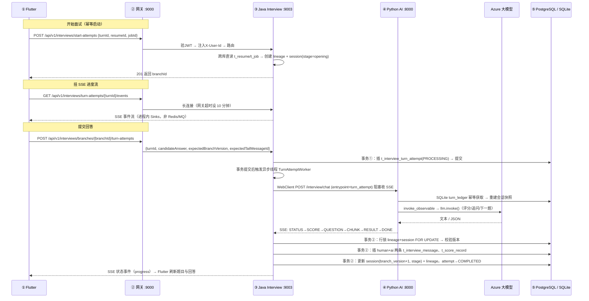

# FDE Day 2 系统基线 · 请求链 / 模型调用点 / 持久化点

> **日期**：2026-08-08　**类型**：静态源码审计（未启动服务验证）
> **范围**：`ai_interviewer_front`（Flutter）、`ai_interview_backend`（Java 多模块）、`ai_interviewer`（Python AI）、`ai_interviewer_admin`（管理后台）
> **基线提交**：`5643772`（main 分支 HEAD）
> **验证方法**：所有文件:行号均经 grep 抽查核实；运行时行为（真实落库、真实延迟）不属于本文档范围，留给 Day 3 用真实请求验证。

---

## 0. 三分钟看懂整个系统

把整个系统想成一场「线上面试」的三个角色：

| 角色 | 对应组件 | 干的活 |
|---|---|---|
| 考生的屏幕 | Flutter 前端 | 收题、提交回答、显示实时状态 |
| 监考老师（收发试卷） | Java 微服务（网关 + 面试服务等） | 验身份、建考场、收卷、把每一问一答存档 |
| 改卷老师 | Python AI 服务 | 真读简历、真出题、真打分 —— **这里才是模型被调用的地方** |
| 改卷老师的大脑 | Azure OpenAI 大模型 | 唯一的"会思考"的地方 |

**一个请求从点击到落库，最多经过 5 站**：

```
① Flutter 点击
   ↓ HTTP (JWT)
② 网关 :9000   —— 验签、限流、路由，往每个服务塞 X-User-Id
   ↓
③ Java 业务服务（面试/简历/用户…）
   ↓ WebClient (JSON / SSE)
④ Python AI :8000 —— 查题库(Chroma)、调大模型、推进面试状态机
   ↓
⑤ 存储：PostgreSQL(业务事实) / Redis(黑名单) / MinIO(简历文件)
          / SQLite+Chroma(仅 Python 侧)
```

**关键数字**：6 个 Java 服务 + 1 个独立管理后台，1 个 Python AI 服务，5 种存储，
**模型推理只有 1 个代码入口、7 个业务调用点**。

---

## 1. 系统组成

| 组件 | 端口 | 说明 |
|---|---|---|
| Flutter 前端 | 8088（web） | 唯一后端入口是网关 :9000，`/api/v1` 前缀 |
| Gateway | 9000 | JWT 验签、路由（StripPrefix=2）、登录限流 10/s、SSE 透传 |
| User 服务 | 9001 | 登录/注册/刷新/登出、BCrypt、JWT 签发、Redis 黑名单 |
| Resume 服务 | 9002 | 简历上传(MinIO)、解析(调 Python)、版本管理 |
| Interview 服务 | 9003 | **面试核心**：SSE 代理 + turn-attempt 状态机 + 消息/评分落库 |
| Job 服务 | 9004 | 岗位 CRUD、本地字符串匹配（不调 Python） |
| Evaluation 服务 | 9005 | 评估报告（jar 级复用 interview 服务，同库读） |
| Notification 服务 | 9006 | 通知（RocketMQ 消费默认关闭） |
| Admin 后台 | 9010 | 独立 Spring Boot 项目，管理题库（调 Python `/admin/question-bank/*`） |
| Python AI | 8000 | FastAPI + LangChain，面试状态机 + 唯一模型调用入口 |
| PostgreSQL | 5433 | 所有 Java 服务共享一个库 `ai_interviewer` |
| Redis | 6380 | JWT 黑名单 + 网关限流计数 |
| MinIO | 19000/19001 | 简历 PDF 文件，bucket `ai-interviewer` |
| Nacos | 8848 | 服务注册发现 + 配置中心 |
| SQLite | — | Python 侧：面试会话 + turn 幂等账本（`storage/database/interviews.db`） |
| ChromaDB | — | Python 侧：题库向量库（`storage/vector_db`） |

> ⚠️ 两个「文档 ≠ 代码」的坑，先立在这儿（详见 §5）：
> 1. `CLAUDE.md` 里的 `USE_LEGACY_DIRECT_PORTS` 直连模式**已被移除**，现在是纯网关模式。
> 2. `CLAUDE.md` 里的 Feign 客户端**不存在**，`ai-interviewer-api` 模块只有 pom.xml。

---

## 2. 完整请求链

### 2.1 链路一：面试对话（主链，durable turn-attempt 模式）

这是当前 Flutter 实际走的链路。它像**「先记账、再干活、干完一次性入账」**的银行系统，
而不是传统的"请求-响应"——目的是回答不丢、断网可恢复、支持回放和分支。

**用户视角的故事线**（打开 App 开始面试）：

```
1. 上传简历 → 选岗位 → 点「开始面试」
2. 页面挂上 SSE 事件流，等着收状态
3. 收到第一道题（开场白/自我介绍/项目题/技术题）
4. 输入回答 → 发送 → 等「评分 + 下一题」
5. 全部题做完 → 结束
```

**每一步内部发生了什么**（数字 = 5 站链路里的位置）：



**为什么要这么绕？四个设计意图**：

1. **不丢回答**：用户的回答先落库（attempt=PROCESSING），模型调用在事务外异步跑。模型挂了，回答还在，可以 retry（`POST /turn-attempts/{id}/retry`），不会"模型超时 = 回答丢失"。
2. **防重复提交**：turnId 由客户端生成（`flutter-<微秒>-<序号>`），服务端幂等检查 + 同 lineage 唯一 PROCESSING 索引（`ux_interview_turn_attempt_lineage_processing`），双击/重发只生效一次。
3. **防并发冲突**：每次提交带 `expectedBranchVersion` + `expectedTailMessageId`，提交时行锁校验，冲突返回 `BRANCH_VERSION_CONFLICT`，前端展示冲突卡片。
4. **可回放可分支**：消息、评分、分支全部落库，历史页用 `GET /interviews/lineages/{id}/tree` + `GET /interviews/branches/{id}/transcript` 重建对话。

**两个事务的边界**（面试服务内，都是 `@Transactional`）：
- `TurnAttemptService.createInternal`（`TurnAttemptService.java:167-233`）：只插 attempt(PROCESSING)，提交后 via `afterCommit` 发布事件。
- `TurnCommitService.commit`（`TurnCommitService.java:32-154`）：**模型调用返回后**，一次性落"消息 + 评分 + 会话状态"，全程行锁。

> **一句话记住**：模型调用夹在事务①和事务②之间 —— 模型永远不在数据库事务里跑。

**超时与恢复**：Java 调 Python 阻塞收流最多 10 分钟（`WebClientTurnModelClient.process` 内 `collectList().block(10min)`）；
卡在 PROCESSING 超过 15 分钟的 attempt 由 `TurnAttemptRecoveryScheduler`（每 1 分钟扫）标记 INTERRUPTED；
前端 SSE 断线按 250ms/500ms/1s 退避重连，连不上就 GET attempt 状态兜底。

### 2.2 链路二：登录 / 注册

```
Flutter login_page
  → POST /api/v1/auth/login {username, password}      ← 网关白名单，不验 JWT
  → User 服务 :9001 /auth/login
      · BCrypt 校验密码（SecurityUtils.matchPassword）
      · JwtUtils 签发 access token（2h）+ refresh token（7d），HS256
  → 前端把两个 token 存 shared_preferences
```

之后每个请求：Dio 拦截器自动带 `Authorization: Bearer <accessToken>` →
网关 `AuthGlobalFilter` 验签 + 校验 type=access → 注入 `X-User-Id / X-User-Name / X-User-Roles` header →
下游服务一律从 header 取用户（不再传 userId 参数）。

- **401 自动续命**：前端收到 401 会用 refreshToken 调 `/auth/refresh`，成功重放原请求，失败清会话跳登录页。
- **登出**：`POST /auth/logout` 把 access token 写入 Redis 黑名单 `auth:blacklist:{token}`（TTL=token 剩余有效期）。
  ⚠️ 注意：**网关不查黑名单**（只验签名），黑名单只在 user 服务内部校验 —— 登出后的 token 仍能过网关，业务接口是否拦截取决于该服务是否调用了 user 的黑名单校验。

### 2.3 链路三：简历上传与解析

```
① Flutter 选 PDF
   → POST /api/v1/resumes/upload (multipart)
   → Resume 服务 :9002
        · MinIO 存文件：resumes/{userId}/{yyyyMMdd}/{uuid}.pdf
        · PostgreSQL：t_resume + t_resume_version
② 解析（页面进下一步时触发）
   → POST /api/v1/resumes/{id}/parse
   → Resume 服务：从 MinIO 下载 → 写临时文件 → multipart POST Python /resume/parse
        · Python 404 时回退旧接口 /interview/upload-resume
   → Python：pypdf 读 PDF → 纯正则提取 姓名/电话/学历/技能 等字段
   → 结果写回 t_resume.parsed_content (jsonb) + t_resume_version
```

> **重点**：简历解析**不调模型**（纯正则）。"AI 解析简历"在这个项目里目前是正则 + pypdf。

### 2.4 链路四：历史 / 回放（只读）

```
GET /api/v1/interviews/lineages                     → 会话列表（分页/关键词/状态）
GET /api/v1/interviews/lineages/{id}/tree           → 分支树
GET /api/v1/interviews/branches/{id}/transcript     → 单个分支的完整问答记录
```

全部读 PostgreSQL，不触达 Python。

### 2.5 兼容链：`/interviews/chat`（旧 SSE 直通链，前端已不用）

Java 侧**保留**了旧的 SSE 代理链（`InterviewController.java:57-75` + `SSEProxyService`）：

```
Flutter(旧) → POST /api/v1/interviews/chat
  → Interview 服务 SSEProxyService.proxyChat (SSEProxyService.java:91-162)
      1. getOrCreateSession：无 session 则建 lineage + session
      2. 行锁（lineage FOR UPDATE + session FOR UPDATE）→ 先落用户消息
      3. WebClient POST Python /interview/chat（entrypoint=interview_chat）SSE 透传
      4. 边收事件边写：score → 插 t_score_record；done → 存 AI 消息、更新 session
      5. 出错不硬断流，返回一条 event:error 的 SSE 事件
```

**现状**：Flutter 的 `InterviewApi.chat()` 是死代码（无任何调用方），事件名
`EVENT_STATUS/CHUNK/SCORE/RESULT/DONE/ERROR` 在现代码中已不存在。这条链仅作兼容保留。

### 2.6 请求链总表

| 前端动作 | HTTP 调用（经网关 /api/v1） | 后端服务 | 是否调 Python | 是否写库 |
|---|---|---|---|---|
| 登录 | POST /auth/login | user | 否 | t_user(读)、Redis 黑名单(写) |
| 上传简历 | POST /resumes/upload | resume | 否 | MinIO、t_resume、t_resume_version |
| 解析简历 | POST /resumes/{id}/parse | resume→Python | 是（无模型，仅正则） | t_resume.parsed_content |
| 开始面试 | POST /interviews/start-attempts | interview | 否 | t_interview_lineage、t_interview_session |
| 挂进度流 | GET /interviews/turn-attempts/{id}/events (SSE) | interview | 否 | 否（进程内 Sinks） |
| 提交回答 | POST /interviews/branches/{id}/turn-attempts | interview→Python | **是（模型）** | attempt/消息/评分/session |
| 追问分支 | POST /interviews/branches/{id}/fork-attempts | interview | 否 | t_interview_session(子分支) |
| 重试/取消 | POST /interviews/turn-attempts/{id}/retry \| cancel \| discard | interview | retry 是 | attempt 状态机 |
| 历史列表 | GET /interviews/lineages | interview | 否 | 读 |
| 回放 | GET /interviews/lineages/{id}/tree、branches/{id}/transcript | interview | 否 | 读 |
| 岗位列表/匹配 | GET /jobs、POST /jobs/{id}/match | job | 否 | 读 |
| 用户信息 | GET /users/me | user | 否 | 读 |

---

## 3. 所有模型调用点

### 3.1 唯一推理入口：`invoke_observable()`

生产代码**只有一个真正的 `llm.invoke()`**：

```
services/observability/langchain.py:177
    ai_message = llm.invoke(prompt_value)
```

业务代码不允许直接碰 LLM，一律经过 `invoke_observable(prompt, call_type=...)`（同文件 135 行起）。
这个入口顺带做三件事：
1. 渲染 prompt（`prompt.invoke(input_values)` 只渲染不推理）；
2. 调模型（`llm.invoke`）—— 唯一推理点；
3. 记账：每次调用写入可观测性记录（配置了 `AI_OBSERVABILITY_DB_URL` 时写 PostgreSQL
   `t_ai_llm_call`，未配置则为空操作）。

**模型是哪个**（`core/model_provider.py:116-144`，环境变量见 §3.5）：
- 主模型 `grok-4-20-reasoning`（Azure OpenAI 兼容端点，`langchain_openai.ChatOpenAI`）；
- 备份模型 `gpt-5.4`，用 `with_fallbacks([backup])` 挂上 —— 主模型失败自动回退；
- `temperature=0.3` 固定；
- **全部同步非流式** —— SSE 的 `chunk` 是模型出完结果后按 20 字符切块（伪流式，`api/sse.py:19-23`）。

### 3.2 七个业务调用点（全部在 `api/interviewer.py`）

| # | 功能 | 调用行 | call_type | 输入 prompt 概要 | 输出解析方式 | 谁触发 |
|---|---|---|---|---|---|---|
| 1 | 开场白 | interviewer.py:62 | generate_opening | 简历前 2000 字 + 职位要求 → "生成 2-3 句开场白" | 纯文本直接用 | 开始面试（`/interview/start`、`/chat` 无 session） |
| 2 | 请求自我介绍 | interviewer.py:78 | ask_self_introduction | 固定文案"请让面试者做自我介绍" | 纯文本 | OPENING 阶段提交 |
| 3 | 项目题批量生成 | interviewer.py:128 | generate_project_questions | 要求生成 N 个项目题，每行一题带序号 | 按行 split + 正则去序号，**一次生成整池** | 自我介绍提交后 |
| 4 | **回答评分** | interviewer.py:180 | evaluate_answer | 问题+回答+简历前 1000 字 → 要求 JSON `{score, feedback, need_followup, followup_reason}` | 正则提取 `{...}` + `json.loads`；失败兜底 **70 分** | 项目题/技术题每答必评（**最频繁的调用**） |
| 5 | 追问生成 | interviewer.py:225 | generate_followup_question | 原问题/回答/追问原因 | 纯文本 | 仅 `score>=70` 且追问 <3 次时 |
| 6 | 面试总结 | interviewer.py:448 | conclude_interview | 全部 QA 汇总 → 要求 JSON `{final_score, feedback}` | 正则 JSON；失败兜底取平均分 | 显式 `POST /interview/{id}/conclude` |
| 7 | 兼容问答 | interviewer.py:490 | ask | system + 对话历史 + 问题 | 纯文本 | `POST /interview/ask`（调试/兼容用） |

**触发这些调用的 Java 入口（汇总）**：

```
Flutter 提交回答 ──→ Java POST /interviews/branches/{id}/turn-attempts
                  ──→ Python POST /interview/chat (entrypoint=turn_attempt)
                  ──→ durable_turn.py 按 stage 分派
                        PROJECT_QNA/TECHNICAL_QNA → 调用点 #4（+可能 #5）
```

面试状态机与调用点的对应（`services/interview_session.py:13-20`，6 个 stage）：

```
RESUM_SUBMITTED → OPENING → SELF_INTRO → PROJECT_QNA → TECHNICAL_QNA → CONCLUDED
     调用点#1      #2          #3            #4(#5)         #4        #6(仅显式)
```

### 3.3 Embedding 调用点（藏在 ChromaDB 里，不是"业务调用"）

- 构造：`core/embeddings.py` → `OpenAIEmbeddings(model=embed-v-4-0, dimensions=1024)`；
- 触发时机：**模块导入时构造**（`api/router.py:54-56` 的 `QuestionBank()`），但**网络调用只发生在**
  - 题库写入：`question_bank.py` 的 `add_documents()`（题目导入、管理后台同步）；
  - 向量检索：`similarity_search()`（`question_bank.py:118`）。
- 检索流程（`search_questions`）：向量 Top-K（fetch_k = max(k*4, k, 20)）+ 全量关键词打分 + RRF 融合
  （RRF_K=60，向量权重 1.0，关键词权重 1.15）—— **混合检索，但只有向量部分是模型（Embedding）调用**。

### 3.4 反直觉清单：哪些地方"看着该调模型，其实没有"

| 功能 | 实际做法 | 说明 |
|---|---|---|
| 技术题检索 | Chroma 相似度 + 关键词 + RRF | 纯检索，无 LLM（`select_technical_questions`） |
| 简历解析 | pypdf + 正则提取字段 | 无 LLM（`resume_router.py:63-127`） |
| 恢复面试 `/interview/resume` | 只回放最后一条 AI 消息 | **不发任何 LLM 调用** |
| chat 状态机题池耗尽 | 直接置 CONCLUDED + 静态文案 | **不调总结模型**；总结必须显式调 `/conclude`（调用点 #6） |
| 岗位匹配 `/jobs/{id}/match` | 本地字符串匹配 | Java 侧，不触达 Python |

> 这是很重要的基线事实：**一次典型面试的模型调用次数 ≈ 开场白 1 + 自我介绍 1 + 项目题生成 1 + 每题评分 1 + （条件触发）追问 + （显式）总结 1**。
> 技术题数量再多也不产生生成调用（题目来自题库检索）。

### 3.5 模型配置（环境变量）

| 变量 | 默认值 | 说明 |
|---|---|---|
| `AZURE_OPENAI_API_KEY` | 必填（缺省或 test-key 直接抛错） | 兼容旧键 `DEEPSEEK_API_KEY` |
| `AZURE_OPENAI_ENDPOINT` | `https://liuwe-...azure.com/openai/v1/` | 自动归一化补 `/openai/v1/` |
| `AZURE_OPENAI_CHAT_MODEL` | `grok-4-20-reasoning` | 主模型 |
| `AZURE_OPENAI_BACKUP_CHAT_MODEL` | `gpt-5.4` | 回退模型（with_fallbacks） |
| `AZURE_OPENAI_EMBEDDING_MODEL` | `embed-v-4-0` | Embedding 模型 |
| `AZURE_OPENAI_EMBEDDING_DIMENSION` | `1024` | 兼容旧键 `DASHSCOPE_EMBEDDING_DIMENSION` |
| `temperature` | 0.3 | 代码固定，无环境变量 |

### 3.6 模型调用的失败模式（代码里怎么兜）

| 失败 | 兜底 |
|---|---|
| 模型返回非 JSON | 正则提取 `{...}`；提取失败评分兜底 70 分 / 总结取平均分 |
| 主模型失败 | `with_fallbacks` 自动切备份模型 |
| Python 整体超时 | Java 阻塞 10 分钟超时 → attempt 标记 FAILED/INTERRUPTED，可 retry |
| 项目题生成失败 | 面试流程中检索失败用 3 个硬编码兜底题 |

---

## 4. 所有持久化点

### 4.1 总览：5 个存储 + 前端，各管一摊

| 存储 | 谁写 | 管什么 | 算不算"业务事实" |
|---|---|---|---|
| PostgreSQL | Java 服务 | 用户/简历/面试/消息/评分/岗位/评估/通知 | ✅ 唯一权威事实库 |
| MinIO | Resume 服务 | 简历原始 PDF | ✅ 文件本体 |
| Redis | User 服务 + 网关 | JWT 黑名单、限流计数 | ⚠️ 可重建的临时态 |
| SQLite | Python 服务 | 面试会话快照 + turn 幂等账本 | ⚠️ 运行态（Java 侧才是权威） |
| ChromaDB | Python 服务 | 题库向量索引 | ✅ 数据源（题目可重导入） |
| 本地文件系统 | Java/Python | 解析用的临时文件 | ❌ 用完即删 |
| shared_preferences | Flutter | token + 待开始面试标记 | ⚠️ 客户端缓存 |

### 4.2 PostgreSQL —— 业务事实（14 张表，按服务分组）

| 服务 | 表 | 内容要点 |
|---|---|---|
| user | `t_user` | 账号、密码(BCrypt)、软删 |
| user | `t_role` / `t_user_role` | 角色（只读，登录时查） |
| resume | `t_resume` | 简历元数据 + `parsed_content`(jsonb 解析结果) |
| resume | `t_resume_version` | 版本历史 |
| interview | `t_interview_lineage` | 面试"家谱"根（支撑回放/分支） |
| interview | `t_interview_session` | 会话主表：stage、status、问题池(jsonb)、branch_version(乐观锁)、pythonSessionId |
| interview | `t_interview_message` | 每一条 human/ai/system 消息，sequence 递增，deliveryStatus |
| interview | `t_interview_turn_attempt` | 提交的"账本"：status 状态机（PROCESSING→COMPLETED/FAILED/INTERRUPTED/…） |
| interview | `t_score_record` | 每题的 0-100 评分 + feedback + 追问标记 |
| job | `t_job` / `t_job_requirement` | 岗位与任职要求 |
| evaluation | `t_evaluation` | 评估报告 |
| notification | `t_notification` | 通知记录 |

写入路径：
- 普通 CRUD：MyBatis-Plus mapper（`user/resume/job/evaluation/notification` 服务）；
- 面试核心：`JdbcTemplate` + 手写 SQL（`TurnAttemptRepository`、`TurnCommitService`、`StartAttemptRepository`、`ForkBranchRepository`），
  行锁 `FOR UPDATE`（session/lineage），Flyway 管理版本（interview 用独立历史表 `flyway_interview_schema_history`）。

> ⚠️ 架构事实：**所有服务共用一个 PostgreSQL**。`interview` 服务直接 JDBC 读其他服务的
> `t_resume` / `t_job`（`StartAttemptRepository.java:15-49`），没有服务间 API/Feign 调用。

### 4.3 Redis —— 只有两种用途

| Key | 谁写 | 内容 | 生命周期 |
|---|---|---|---|
| `auth:blacklist:{token}` | User 服务（logout / refresh） | JWT 黑名单 | TTL = token 剩余有效期 |
| 限流计数 | 网关 RequestRateLimiter | 登录接口 10/s、burst 20 | 分钟级 |

> 基线事实：Redis **没有**存会话、没有存面试状态 —— 面试进度全在 PostgreSQL。
> Python 侧完全不碰 Redis。

### 4.4 MinIO —— 简历文件

- bucket：`ai-interviewer`（`MinioConfig.java:50`，启动自动 ensureBucketExists）；
- 路径：`resumes/{userId}/{yyyyMMdd}/{uuid}{ext}`；
- 操作：putObject（上传）、getObject（解析下载）、removeObject（删除）、statObject（校验）；
- 简历删除时 MinIO 对象与 `t_resume` 记录一并处理。

### 4.5 SQLite（Python 侧）—— `storage/database/interviews.db`

| 表 | 内容 | 写入时机 |
|---|---|---|
| `interview_records` | 会话快照：简历文本、stage、问题池(JSON)、QA 列表、final_score | **每次 stage 转换后** `_save_session`（`interview_service.py:529-532`） |
| `turn_ledger` | turn 幂等账本：turn_id + input_hash + status(PROCESSING/COMPLETED) + result_payload | durable turn 执行前获取 / 完成后提交（CAS 幂等） |

- 路径可用 `AI_INTERVIEW_DB_PATH` 覆盖，默认 `storage/database/interviews.db`；
- **定位**：Python 侧的状态是"运行态缓存"，Java 侧 PostgreSQL 才是权威事实。
  两者各自演进，靠 `turn_id` 关联 —— 这是当前架构一个值得跟踪的一致性问题。

### 4.6 ChromaDB（Python 侧）—— 题库向量库

- 路径：`AI_INTERVIEW_VECTOR_DB_PATH` 或 `storage/vector_db`；Collection：`interview_questions`；
- 写入：题目导入 `import_question_file`（chunk 1000/overlap 200，`add_documents`）、管理后台同步 `sync_structured_questions`（固定 id `admin-question-{id}`）、删除 `delete_structured_questions`；
- 读取：面试技术题检索（`similarity_search` + 关键词 + RRF）；
- 本体：SQLite（chroma.sqlite3：Collection/文档/Metadata）+ HNSW 二进制索引（UUID 目录）。

### 4.7 本地文件系统 —— 临时文件（用完即删）

| 位置 | 用途 |
|---|---|
| Java `ResumeService.callPythonParse:318-319` | MinIO 文件转临时文件发给 Python，finally 删除 |
| Python `router.py:731-746` | 题目导入写临时文件，finally unlink |

### 4.8 前端本地存储 —— shared_preferences（仅 3 个 key）

| key | 内容 | 说明 |
|---|---|---|
| `accessToken` | JWT 访问令牌 | **明文存储**，无 secure storage |
| `refreshToken` | JWT 刷新令牌 | 明文 |
| `interview.pending_start.v1` | `{turnId, resumeId, jobId}` | 点"开始面试"先落盘再请求，崩溃可恢复（幂等启动） |

清除时机：登出、换 token、会话过期。面试草稿/进度**不存前端**，全在服务端。

### 4.9 可选持久化（默认关闭）

| 项 | 开关 | 写什么 |
|---|---|---|
| 自建 AI 追踪 | `AI_OBSERVABILITY_DB_URL` | PostgreSQL `t_ai_trace` / `t_ai_trace_step` / `t_ai_llm_call` |
| LangSmith | `LANGSMITH_TRACING=true`（默认关） | 云端 Trace |
| LangGraph checkpoint | `LANGGRAPH_AGENT_RUN_ENABLED`（默认关） | `storage/agent_checkpoints.sqlite3` |
| 手动流程录制 | `MANUAL_FLOW_RECORDER_ENABLED`（默认关） | `tests/reports/manual-traces/*.json` |

---

## 5. 基线发现（值得写进简历和面试的"我看过代码"证据）

1. **模型调用收敛得极好**：全生产代码只有 1 个 `llm.invoke` 入口（`langchain.py:177`）+ 7 个业务调用点，
   全部集中在 `api/interviewer.py`。这既是优点（好记账、好换模型）也是风险点（所有业务共用一个入口，
   一处超时策略影响全部）。
2. **模型永远不在数据库事务里**：durable 路径是「先落 attempt(PROCESSING) → 事务外调模型 → 结果回一个大事务」，
   模型失败不会污染库，可 retry。这是当前代码最值得讲的设计。
3. **"流式"是伪流式**：模型是同步调用，SSE 的 chunk 是 20 字符切块。真正流式（streaming output）是 Day 8+ 的优化项。
4. **技术题检索不调模型**：题目池来自 ChromaDB 混合检索（向量 1.0 / 关键词 1.15 / RRF），
   模型只做评分和追问判断。面试的模型成本 ≈ 每题 1 次评分调用。
5. **简历解析不调模型**（纯正则），岗位匹配不调模型（本地字符串）—— 这两个都是未来上 LLM 的优化点。
6. **文档与代码不一致**（已核实）：
   - `CLAUDE.md` 的 `USE_LEGACY_DIRECT_PORTS` 直连模式已随 commit `df7b1da` 移除；
   - `CLAUDE.md` 的 Feign 客户端不存在，`ai-interviewer-api` 模块是空壳；跨服务靠"同库直读 + jar 复用"；
   - `docs/ARCHITECTURE.md` 的 `/interviews/chat` 主链描述已过时，前端实际走 turn-attempt 链。
7. **安全观察**：前端 token 明文存 shared_preferences（建议 secure storage）；网关不查 Redis 黑名单
   （登出后 token 仍可过网关，取决于各服务是否校验）；CORS `allowedOriginPatterns: "*"`。
8. **一致性风险**：Python SQLite（会话快照）与 Java PostgreSQL（权威事实）双写，靠 turn_id 关联，
   没有同步机制 —— 回放功能以后端为准，Python 侧快照仅用于状态机推进。
9. **Redis 用途极小**：只有 JWT 黑名单 + 网关限流，没有任何缓存 —— 面试进度全在库上，读历史都是查库。

---

## 6. 如何自己复现验证（静态 → 动态）

```bash
# 1. 确认唯一推理入口
grep -rn "\.invoke(" ai_interviewer/ --include="*.py" | grep -v test | grep -v agent_runtime

# 2. 确认 7 个业务调用点
grep -n "call_type=" ai_interviewer/api/interviewer.py

# 3. 确认 Java → Python 的 3 个调用点
grep -rn "pythonBaseUrl + \"/interview" ai_interview_backend/ai-interviewer-interview/src/main/java/

# 4. 确认持久化表清单
grep -rn "@TableName" ai_interview_backend/*/src/main/java/ | awk -F'"' '{print $2}'

# 5. 确认模型配置（.env）
cat ai_interview_backend/.env | grep AZURE

# 6. 动态验证（Day 3）：启动 infra + 服务后，用一条真实回答走完
#    start-attempts → turn-attempts → SSE events，对照 t_interview_* 表落库情况
```

---

*本文档为 Day 2 静态基线。Day 3 将以一条脱敏真实面试验证：请求链路真实走向、每次模型调用的
延迟/成本、PostgreSQL/SQLite 实际落库内容。*
