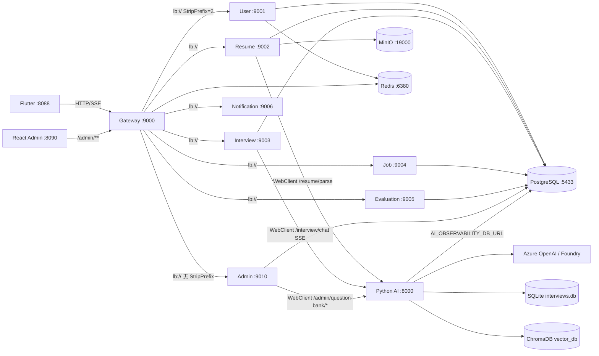
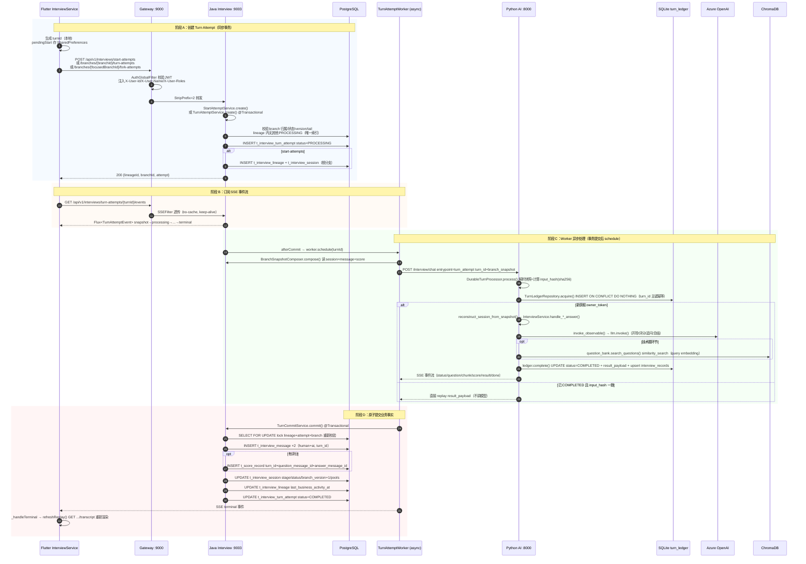
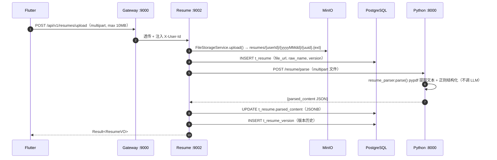
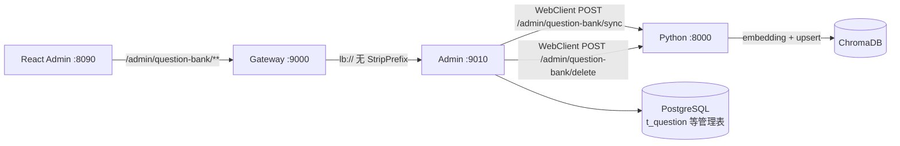
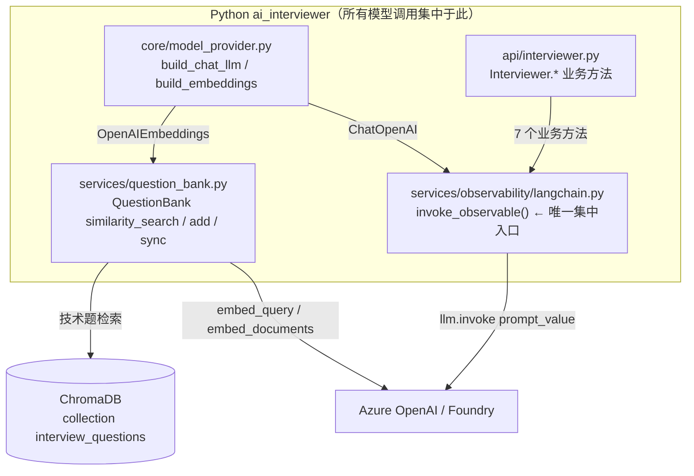
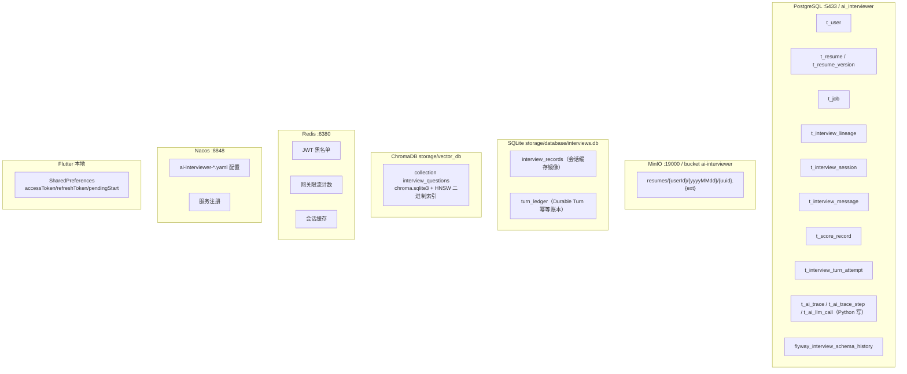

# FDE Day 2 系统基线（GLM 复核版）

> 本文档由 GLM 5.2 基于 `my_ai_interviewer` 仓库源码独立审计产出，不参考既有 `FDE_DAY2_SYSTEM_BASELINE.md`。
> 范围：画完整请求链、列出所有模型调用点、列出所有持久化点。
> 证据类型：静态源码 + 配置文件审计（未做实时运行时验证）。
> 审计日期：2026-08-07。

---

## 0. 顶层架构与基础设施

### 0.1 子项目与端口

| 子项目 | 技术栈 | 端口 | 角色 |
|---|---|---|---|
| `ai_interviewer_front` | Flutter/Dart | 8088 (web) | 用户端，统一走网关 |
| `ai_interviewer_admin_front` | React/TS | 8090 | 企业管理端（独立） |
| `ai-interviewer-gateway` | Java/Spring Cloud Gateway | 9000 | 鉴权 + 路由 + 限流 |
| `ai-interviewer-user` | Java/Spring Boot | 9001 | 用户/认证/JWT |
| `ai-interviewer-resume` | Java/Spring Boot | 9002 | 简历 + MinIO + 调 Python 解析 |
| `ai-interviewer-interview` | Java/Spring Boot | 9003（仅 expose） | 面试核心 + Durable Turn + SSE 代理 |
| `ai-interviewer-job` | Java/Spring Boot | 9004 | 岗位 |
| `ai-interviewer-evaluation` | Java/Spring Boot | 9005（仅 expose） | 评估 |
| `ai-interviewer-notification` | Java/Spring Boot | 9006 | 通知（HTTP + 可选 RocketMQ） |
| `ai_interviewer_admin` | Java/Spring Boot | 9010 | Admin 后台（独立 Maven 项目） |
| `ai_interviewer` | Python/FastAPI | 8000 | AI 核心（LangChain + Azure OpenAI + ChromaDB） |

### 0.2 基础设施（`ai_interview_backend/docker-compose.yml`）

| 组件 | 主机端口 : 容器端口 | 用途 |
|---|---|---|
| Nacos | 8848 | 服务发现 + 配置中心（`optional:nacos:ai-interviewer-*.yaml`） |
| PostgreSQL 16 | 5433 : 5432 | 全部 Java 微服务共享，库 `ai_interviewer` |
| Redis 7 | 6380 : 6379 | JWT 黑名单、网关限流、会话缓存 |
| MinIO | 19000/19001 : 9000/9001 | 简历文件存储，bucket `ai-interviewer` |

### 0.3 跨项目数据流总览



**关键边界**：Flutter 不直接调用 Python AI；所有 AI 调用都由 Java Resume/Interview/Admin 服务经 WebClient 发起。模型调用全部集中在 Python 进程内。

---

## 1. 完整请求链

系统存在两条面试请求链：

- **主链（Durable Turn Attempt）**：Flutter → Gateway → Java Interview → Python SSE → PostgreSQL 原子提交。这是 `InterviewService`（`lib/services/interview_service.dart`）当前实际使用的路径。
- **旧直通 SSE 兼容链**：Flutter → Gateway → Java `SSEProxyService` → Python `/interview/chat`（`entrypoint=interview_chat`，无 `turn_id`/`branch_snapshot`）。`InterviewApi.chat()` 仍保留，但 `InterviewService.sendMessage()` 已委托给 `submitTail()`（主链）。

### 1.1 主链：Durable Turn Attempt（启动 + 普通 Turn + Fork）



#### 1.1.1 主链关键代码定位

**Flutter 侧**（`ai_interviewer_front/lib/`）：

- `services/interview_service.dart`：`startNewInterview()` → `_performStart()`；`submitTail()` → `createTurnAttempt()`；`submitFork()` → `createForkAttempt()`；`_consumeAttemptEvents()` 订阅 SSE 并带重连退避（250ms/500ms/1s）。`sendMessage()` 已委托 `submitTail()`，即用户消息也走 Durable 路径。
- `api/interview_api.dart`：`startAttempt()` / `createTurnAttempt()` / `createForkAttempt()` / `getTurnAttemptEvents()`（SSE）/ `retryTurnAttempt()` / `cancelTurnAttempt()` / `discardTurnAttempt()`。
- `api/api_client.dart`：`gatewayBaseUrl = http://localhost:9000`（env `GATEWAY_BASE_URL`），所有 service base URL 均指向网关；`Authorization: Bearer` 从 `SharedPreferences` 注入，401 时自动 `/auth/refresh` 重试一次。
- `services/pending_start_store.dart`：未完成的启动请求（turnId/resumeId/jobId）落 `SharedPreferences`，崩溃后可恢复。

**Gateway 侧**（`ai-interviewer-gateway/`）：

- `application.yml`：`/api/v1/interviews/**` → `lb://ai-interviewer-interview`，`StripPrefix=2`，`response-timeout: 600000`（10 分钟，SSE 长连接）。
- `filter/AuthGlobalFilter.java`：校验 `Authorization: Bearer`，注入 `X-User-Id`/`X-User-Name`/`X-User-Roles`；白名单 `/api/v1/auth/login|register|refresh`、`/admin/**`、文档路径。
- `filter/SSEFilter.java`：对 `/api/v1/interviews/chat`、`/api/v1/interviews/{id}/resume` 或 `Accept: text/event-stream` 请求设置 `no-cache`/`keep-alive`/`X-Accel-Buffering: no`。Durable Turn 的 `GET .../turn-attempts/{turnId}/events` 因带 `Accept: text/event-stream` 同样被透传。

**Java Interview 侧**（`ai-interviewer-interview/`）：

- `controller/StartAttemptController.java`：`POST /interviews/start-attempts` → `StartAttemptService.create()`。
- `controller/TurnAttemptController.java`：`POST /interviews/branches/{branchId}/turn-attempts`、`GET /interviews/turn-attempts/{turnId}/events`、`POST .../retry|cancel|discard`、`POST /interviews/branches/{focusedBranchId}/fork-attempts`。
- `service/StartAttemptService.java`：`@Transactional`，`rootId = "start-" + UUID.nameUUIDFromBytes("interview-start:"+turnId)`；插入 lineage + root branch + 首个 turn_attempt（`candidateAnswer="我准备好了"`，`expectedBranchVersion=1`，`expectedTailMessageId=null`）；幂等 replay。
- `service/TurnAttemptService.java`：`@Transactional createInternal()` 校验四件套（ownership / branch active=1 / `expectedBranchVersion` / `expectedTailMessageId`）+ `LINEAGE_PROCESSING_CONFLICT`（同一 lineage 不允许第二个 PROCESSING）；`turn_id` 主键幂等，payload 不一致抛 `IDEMPOTENCY_PAYLOAD_MISMATCH`；`afterCommit` → `worker.schedule()`。
- `service/TurnAttemptWorker.java`：`AsyncTaskExecutor`（`turnAttemptExecutor`：core 2 / max 4 / queue 100，见 `application.yml` `interview.turn-attempt.executor`）；`TaskControl` 状态机管理取消/中断；`process()` 调 `BranchSnapshotComposer` + `WebClientTurnModelClient` + `TurnCommitService`。
- `service/BranchSnapshotComposer.java`：组装 `BranchSnapshot`（`SCHEMA_VERSION=1`），合并祖先前缀 + 当前分支增量消息与评分，校验 tail 一致。
- `model/WebClientTurnModelClient.java`：`POST {python.ai.base-url}/interview/chat`，`entrypoint=turn_attempt`，`block(Duration.ofMinutes(10))`，收集 SSE 事件为 `TurnModelResult`，强校验 `result/done` 阶段一致与 `post_turn_state` 完整。
- `service/TurnCommitService.java`：`@Transactional commit()`，`SELECT FOR UPDATE` 锁 lineage+attempt+branch，重新校验后原子写入消息/评分/会话/谱系，`branch_version+1`，`markCompleted`。
- `service/TurnAttemptRecoveryScheduler.java`：定时把 `PROCESSING` 超 `PT15M` 的 turn 标记为 `INTERRUPTED`（`interview.turn-attempt.stale-after`）。
- `repository/TurnAttemptRepository.java` + `V1` 迁移：唯一索引 `ux_interview_turn_attempt_lineage_processing ON t_interview_turn_attempt(lineage_id) WHERE status='PROCESSING'` 在 DB 层兜底保证同一谱系至多一个进行中轮次。

**Python 侧**（`ai_interviewer/`）：

- `api/router.py` `chat_stream()`：`is_durable_turn = entrypoint=="turn_attempt" or turn_id or branch_snapshot`；命中则 `_get_durable_turn_processor().process()`，否则走旧 stage 分支。
- `services/durable_turn.py` `DurableTurnProcessor.process()`：`BranchSnapshot.model_validate` → `compute_input_hash`（sha256 canonical JSON）→ `TurnLedgerRepository.acquire()`（SQLite `turn_ledger` 幂等）→ `reconstruct_session_from_snapshot()` → `InterviewService(persist_sessions=False)` 处理 → `ledger.complete()`（写 `result_payload` + upsert `interview_records`）。
- `services/branch_reconstruction.py`：把 `BranchSnapshot` 还原成 `InterviewSession`（含 history、qa、pools）。
- `schemas/branch_snapshot.py`：`SUPPORTED_BRANCH_SNAPSHOT_SCHEMA_VERSION=1`，校验 `path_order` 唯一、tail 一致、assessment 引用消息在路径内。

### 1.2 旧直通 SSE 兼容链（`interview_chat` entrypoint）

```mermaid
sequenceDiagram
    autonumber
    participant FL as Flutter InterviewApi.chat()
    participant GW as Gateway :9000
    participant JV as Java SSEProxyService :9003
    participant DB as PostgreSQL
    participant PY as Python /interview/chat
    participant LLM as Azure OpenAI

    FL->>GW: POST /api/v1/interviews/chat {sessionId,message,resumeId,jobId} Accept: text/event-stream
    GW->>JV: 校验+透传
    JV->>DB: getOrCreateSession() 读/建 t_interview_session + t_interview_lineage
    JV->>DB: saveUserMessage() INSERT t_interview_message (human)
    JV->>PY: POST /interview/chat entrypoint=interview_chat（无 turn_id/branch_snapshot）
    PY->>PY: chat_stream() is_durable_turn=false → 旧 stage 分支
    alt 无 sessionId
    PY->>PY: create_session() + generate_opening()
    PY->>LLM: invoke_observable() → llm.invoke()（开场）
    else 有 session
    PY->>PY: 按 stage handle_opening_response / handle_self_introduction / handle_project_answer / handle_technical_answer
    PY->>LLM: invoke_observable() → llm.invoke()（评分/追问/下一题/总结）
    PY->>PY: save_session() upsert SQLite interview_records
    PY-->>JV: SSE 事件流（status/question/chunk/score/result/done）
    JV-->>FL: 透传 SSE
    note over JV,DB: 同时拦截事件落库
    JV->>DB: status → update python_session_id（t_interview_session）
    JV->>DB: score → INSERT t_score_record
    JV->>DB: done → update session stage/status/branch_version + INSERT AI message + UPDATE lineage
```

**兼容链关键代码定位**：

- Java `controller/InterviewController.java` `chat()` → `SSEProxyService.proxyChat()`。
- Java `service/SSEProxyService.java`：调 Python `/interview/chat`（`entrypoint=interview_chat`），流式透传给前端，同时拦截 `status/score/done` 等事件落库到 `t_interview_session`/`t_interview_lineage`/`t_interview_message`/`t_score_record`。
- Python `api/router.py` `chat_stream()`：`is_durable_turn=false` 时按 `InterviewStage` 分派到 `interview_service` 的 `handle_*` 方法，每步经 `Interviewer.*` → `invoke_observable()` → `llm.invoke()`，并通过 `SessionManager.save_session()` 写 SQLite `interview_records`。
- 该链与主链的差异：**无 `turn_id` 幂等、无 `branch_snapshot` 还原、无 `turn_ledger`、无 Worker 异步、无 `SELECT FOR UPDATE` 原子提交**；落库由 Java SSE 拦截事件驱动，非事务原子。

### 1.3 其他请求链

#### 1.3.1 简历上传与解析链



- Java `ai-interviewer-resume/service/ResumeService.java` `parseResume()`：调 Python `/resume/parse`（失败回退 `/interview/upload-resume`），结果写 `t_resume.parsed_content`。
- Python `api/resume_router.py` `/resume/parse` → `services/resume_parser.py`：`pypdf` 抽文本 + 正则抽取结构化字段，**不调用 LLM**。

#### 1.3.2 题库管理链（Admin → Python → ChromaDB）



- `docker-compose.yml` 中 Admin 注入 `PYTHON_AI_QUESTION_BANK_SYNC_URL=http://python-ai:8000/admin/question-bank/sync` 与 `.../delete`。
- Python `api/admin_router.py` `/admin/question-bank/sync` → `question_bank.sync_structured_questions()`：调 embedding 模型生成向量后写入 ChromaDB collection `interview_questions`。

#### 1.3.3 鉴权链（Flutter → Gateway → User）

- `POST /api/v1/auth/login|register|refresh` → Gateway 白名单直通 → User :9001。
- User 服务校验账号密码（BCrypt），签发 JWT（access 2h / refresh 7d），refresh 时检查 Redis JWT 黑名单。
- 登出时 access token jti 写入 Redis 黑名单，`AuthGlobalFilter` 命中黑名单即 401。

---

## 2. 所有模型调用点

### 2.1 调用点全景



**核心结论**：

1. **所有 LLM 调用都集中在 Python 进程**。Java 与 Flutter 不直接调用任何模型。
2. **所有 Chat 调用都经过唯一集中入口** `services/observability/langchain.py::invoke_observable()`，再 `llm.invoke(prompt_value)`。
3. **所有 Embedding 调用都经 ChromaDB 的 `similarity_search` / `add_documents` 触发**，由 `OpenAIEmbeddings` 在底层发起。
4. **简历解析不调用模型**：`services/resume_parser.py` 用 `pypdf` + 正则抽取结构化字段。

### 2.2 Chat 模型调用点（7 个业务方法，全部经 `invoke_observable`）

| # | 业务方法（`api/interviewer.py`） | call_type | 触发场景 | 阶段 |
|---|---|---|---|---|
| 1 | `generate_opening()` | `generate_opening` | 新会话开场白 / `start-attempts` 首轮 | OPENING |
| 2 | `ask_self_introduction()` | `ask_self_introduction` | 引导候选人自我介绍 | SELF_INTRO |
| 3 | `generate_project_questions()` | `generate_project_questions` | 基于简历生成项目题池 | PROJECT_QNA |
| 4 | `evaluate_answer()` | `evaluate_answer` | 评分候选人回答 + 决定是否追问 | PROJECT_QNA / TECHNICAL_QNA |
| 5 | `generate_followup_question()` | `generate_followup_question` | 生成追问 | PROJECT_QNA / TECHNICAL_QNA |
| 6 | `conclude_interview()` | `conclude_interview` | 面试总结 | CONCLUDED |
| 7 | `ask()` | `ask` | 旧直通链 `/interview/ask` 通用问答 | 任意 |

集中入口实现（`services/observability/langchain.py`）：

```python
# invoke_observable 是所有 Chat 调用的唯一集中入口
def invoke_observable(
    llm, prompt_value, *, call_type, trace_id, step_name, ...
):
    # 1. 记录请求/prompt 到 observability repository
    # 2. llm.invoke(prompt_value)  ← 真正的模型调用
    # 3. 记录响应/token/latency/status
    return llm.invoke(prompt_value)
```

`Interviewer` 的每个业务方法都形如 `invoke_observable(self.llm, prompt, call_type="generate_opening", ...)`，无一例外直接调 `self.llm.invoke()`。

### 2.3 Embedding 模型调用点

| # | 触发位置 | 操作 | 说明 |
|---|---|---|---|
| 1 | `question_bank.search_questions()` | `Chroma.similarity_search(query, k)` | 技术题检索时对 query 做 embedding |
| 2 | `question_bank.add_documents()` | `Chroma.add_documents(docs)` | 导入 PDF/TXT/MD 时对 chunk 做 embedding |
| 3 | `question_bank.sync_structured_questions()` | `Chroma.add_texts(...)` | Admin 同步结构化题目时 embedding |
| 4 | `question_bank.delete_structured_questions()` | `Chroma.delete()` | 仅删除，不调 embedding |

Embedding 实例由 `core/embeddings.py::get_embeddings()` → `core/model_provider.py::build_embeddings()` 构建（`OpenAIEmbeddings`，模型 `embed-v-4-0`，维度 1024）。文档切分用 `RecursiveCharacterTextSplitter`（`chunk_size=1000`，`chunk_overlap=200`）。

### 2.4 模型配置边界（`core/model_provider.py`）

| 配置项 | 环境变量 | 默认值 | 说明 |
|---|---|---|---|
| Chat endpoint | `AZURE_OPENAI_ENDPOINT` | `https://liuwe-m7o7yvmk-eastus2.services.ai.azure.com/openai/v1/` | Azure Foundry 网关 |
| Chat API key | `AZURE_OPENAI_API_KEY` | 必填（兼容旧 `DEEPSEEK_API_KEY`） | |
| Chat 主模型 | `AZURE_OPENAI_CHAT_MODEL` | `grok-4-20-reasoning` | |
| Chat 备用模型 | `AZURE_OPENAI_BACKUP_CHAT_MODEL` | `gpt-5.4` | |
| Embedding 模型 | `AZURE_OPENAI_EMBEDDING_MODEL` | `embed-v-4-0` | |
| Embedding 维度 | `AZURE_OPENAI_EMBEDDING_DIMENSION` | `1024`（兼容旧 `DASHSCOPE_EMBEDDING_DIMENSION`） | 必须与 Chroma collection 一致 |
| 温度 | （硬编码） | `0.3` | `get_llm()` 中固定 |

**重要边界**：

- `CLAUDE.md` / `AGENTS.md` 仍提到 DeepSeek + DashScope，但源码已迁移到 Azure OpenAI / Foundry（`grok-4-20-reasoning` + `gpt-5.4` + `embed-v-4-0`）。旧环境变量仅作兼容回退。
- `temperature=0.3` 硬编码在 `core/config.py::get_llm()`，未走配置。
- Observability（`t_ai_trace`/`t_ai_trace_step`/`t_ai_llm_call`）由 `AI_OBSERVABILITY_DB_URL` 控制；未配置时退化为 `NoopObservabilityRepository`，模型照常调用但不上报。

---

## 3. 所有持久化点

### 3.1 持久化全景图



### 3.2 PostgreSQL（Java 业务事实的主存储，库 `ai_interviewer`）

| 表 | 所属服务 | 关键字段 | 写入时机 |
|---|---|---|---|
| `t_user` | User | id, username, password(BCrypt), email, roles | 注册/改资料 |
| `t_resume` | Resume | id, user_id, file_url, raw_name, parsed_content(JSONB), version, is_default | 上传/解析/设默认 |
| `t_resume_version` | Resume | resume_id, version, file_url, parsed_content | 每次解析留版本 |
| `t_job` | Job | id, company, title, requirements | 企业端发布 |
| `t_interview_lineage` | Interview | id, user_id, resume_id, job_id, root_session_id, last_business_activity_at | `start-attempts` 创建谱系 |
| `t_interview_session` | Interview | id, lineage_id, parent_session_id, fork_point_message_id, branch_label, branch_version, stage, status, python_session_id, resume_id, job_id, candidate_name, resume_content, job_requirements, project_questions_count, target_project_questions, current_followup_count, project_questions_pool(JSONB), technical_questions_pool(JSONB), last_question, started_at, finished_at, last_business_activity_at, legacy_migrated | 创建分支 / 每次 turn 提交后更新 |
| `t_interview_message` | Interview | id, session_id, role(human/ai/system), content, stage, sequence, turn_id, message_type, expects_response, delivery_status, metadata(JSONB) | 主链 `TurnCommitService` 或兼容链 `SSEProxyService` 落库 |
| `t_score_record` | Interview | id, session_id, question_index, question_type, question, answer, score, feedback, is_followup, turn_id, question_message_id, answer_message_id | 有评分的 turn 提交 |
| `t_interview_turn_attempt` | Interview | id(PK), lineage_id, session_id, owner_user_id(FK→t_user), expected_branch_version, expected_tail_message_id, candidate_answer, status, retry_of_id, agent_run_id, request_id, username, fork_source_session_id, fork_trigger_message_id, fork_point_message_id, fork_expected_source_version, fork_expected_source_tail_message_id, error_code, diagnostic_ref, processing_started_at, completed_at, failed_at, cancelled_at | 创建/重试/取消/丢弃/完成 turn |
| `t_ai_trace` / `t_ai_trace_step` / `t_ai_llm_call` | Python 写 | trace_id, step_name, call_type, prompt, response, token usage, latency, status | 每次 `invoke_observable` 调用（若 `AI_OBSERVABILITY_DB_URL` 配置） |
| `flyway_interview_schema_history` | Interview | 版本/脚本/checksum | 启动时 Flyway 迁移（V1–V6） |

**关键约束**：

- `t_interview_turn_attempt` 唯一部分索引 `ux_interview_turn_attempt_lineage_processing ON (lineage_id) WHERE status='PROCESSING'`（V1 迁移）——DB 层保证同一谱系至多一个进行中轮次。
- `t_interview_turn_attempt.owner_user_id` 由 V4 迁移补齐并加外键 `fk_interview_turn_attempt_owner → t_user(id)`。
- `t_interview_message.turn_id` / `message_type` / `metadata` 由 V1 增量列加入，用于关联 Durable Turn。
- `t_score_record.turn_id` / `question_message_id` / `answer_message_id` 由 V1 增量列加入，保证评分与消息原子绑定。
- Interview 服务用 Flyway（`spring.flyway.table=flyway_interview_schema_history`），其余服务为 MyBatis-Plus 自动建表/手动维护。

### 3.3 MinIO（简历文件存储，bucket `ai-interviewer`）

| 对象 | 路径模式 | 写入时机 |
|---|---|---|
| 简历原件 | `resumes/{userId}/{yyyyMMdd}/{uuid}.{ext}` | `FileStorageService.upload()` 在 `ResumeService.upload()` 中调用 |

- Java `ai-interviewer-resume/service/FileStorageService.java`：封装 MinIO `putObject`/`getObject`/`removeObject`，启动时确保 bucket 存在。
- 配置：`minio.endpoint=http://localhost:19000`，`minio.bucket=ai-interviewer`（容器内 `http://minio:9000`）。

### 3.4 SQLite（Python 运行时状态，`storage/database/interviews.db`，env `AI_INTERVIEW_DB_PATH`）

| 表 | 用途 | 写入时机 |
|---|---|---|
| `interview_records` | Python 侧会话缓存镜像（可重建） | 旧链 `SessionManager.save_session()` / Durable 链 `ledger.complete()` upsert |
| `turn_ledger` | Durable Turn 幂等账本（`turn_id` 主键，`input_hash`，`status` PROCESSING/COMPLETED，`owner_token`，`result_payload`） | `TurnLedgerRepository.acquire()`（INSERT ON CONFLICT DO NOTHING）/ `complete()`（UPDATE） |

- `services/database.py` 定义 `InterviewRecord` 与 `TurnLedgerRecord` 两个 ORM 模型，`SQLAlchemy` + `sqlite`。
- `turn_ledger` 是 Durable Turn 幂等的核心：相同 `turn_id` + 相同 `input_hash` 的重复请求会 replay `result_payload`，不再调模型。

### 3.5 ChromaDB（向量库，`storage/vector_db`，env `AI_INTERVIEW_VECTOR_DB_PATH`）

| 资源 | 说明 |
|---|---|
| Collection `interview_questions` | 技术题向量集合，embedding 维度 1024 |
| `chroma.sqlite3` | collection/segment/document/metadata 元数据 |
| HNSW 二进制索引 | `<uuid>/data_level0.bin`、`header.bin`、`length.bin`、`link_lists.bin` |

- `services/question_bank.py` `QuestionBank`：初始化 `Chroma(client_settings=Settings(anonymized_telemetry=False))`，`embedding_function=get_embeddings()`。
- 检索：混合检索 = 向量（weight 1.0）+ 关键词（weight 1.15）+ RRF（k=60）融合。
- 切分：`RecursiveCharacterTextSplitter(chunk_size=1000, chunk_overlap=200)`。

### 3.6 Redis（缓存/状态，:6380）

| 用途 | 使用方 | Key 模式 |
|---|---|---|
| JWT 黑名单 | User（登出写）/ Gateway（鉴权读） | `jwt:blacklist:{jti}` |
| 网关限流 | Gateway `RequestRateLimiter` + `KeyResolver`（IP / UserId） | `request_rate_limiter.{ip|userId}.{timestamp}` |
| 会话缓存 | 各服务 `spring.cache`（按需） | 视配置 |

### 3.7 Nacos（配置 + 注册，:8848）

- 注册：所有 Java 微服务启动注册到 `nacos.discovery`。
- 配置：`spring.config.import=optional:nacos:ai-interviewer-{service}.yaml`，集中管理 datasource/redis/python-ai base-url 等。
- Admin 服务 `NACOS_ENABLED=true` 时同样接入。

### 3.8 Flutter 本地状态（`SharedPreferences`）

| Key | 内容 | 写入时机 |
|---|---|---|
| `accessToken` | JWT access | 登录/refresh 成功 |
| `refreshToken` | JWT refresh | 登录/refresh 成功 |
| pendingStart | turnId/resumeId/jobId | `startNewInterview()` 发起前预写，成功后清除 |

- `lib/services/pending_start_store.dart`：崩溃/重启后读取 pendingStart 决定是否重试启动。
- `lib/api/api_client.dart`：拦截器从 SharedPreferences 注入 Bearer，401 触发 `/auth/refresh` 单次重试。

### 3.9 可选/默认关闭的持久化（Python）

| 资源 | 开关（默认） | 说明 |
|---|---|---|
| LangGraph checkpoint SQLite `storage/agent_checkpoints.sqlite3` | `LANGGRAPH_AGENT_RUN_ENABLED=false` | Agent 运行断点续跑 |
| Manual flow recorder JSONL `tests/reports/manual-traces/*.jsonl` | `MANUAL_FLOW_RECORDER_ENABLED=false` | 手动流程录制 |
| LangSmith tracing（外部 SaaS） | `LANGSMITH_TRACING=false` | LangChain 云端追踪 |

---

## 4. 审计边界与已知差异

1. **文档与代码的模型口径不一致**：`CLAUDE.md` / `AGENTS.md` 仍写 DeepSeek + DashScope，但 `core/model_provider.py` 已切到 Azure OpenAI / Foundry（`grok-4-20-reasoning` / `gpt-5.4` / `embed-v-4-0`）。本文档以源码为准。
2. **两条链并存**：主链（Durable Turn）与旧直通 SSE 兼容链同时存在；`InterviewService.sendMessage()` 已走主链，但 `InterviewApi.chat()` 与 `InterviewController.chat()`/`SSEProxyService` 仍保留，需确认是否还有调用方。
3. **简历解析无 LLM**：`services/resume_parser.py` 用正则抽取结构化字段，未调用模型；若需高质量结构化解析，是潜在改进点。
4. **Observability 可降级**：`AI_OBSERVABILITY_DB_URL` 未配置时为 `NoopObservabilityRepository`，模型调用照常但无 trace 上报，生产环境需确认配置。
5. **温度硬编码**：`temperature=0.3` 写死在 `get_llm()`，未走环境变量，调整需改代码。
6. **证据类型**：本文档为静态源码审计，未做运行时验证（未启动全栈观察实际 SSE/落库行为）。后续可作为 Day 3 的运行时验证任务。
7. **未覆盖模块**：Evaluation（:9005）、Notification（:9006）、Job（:9004）的详细业务表结构未深入（与本 Day 2 三大任务无关），如需可补审计。
