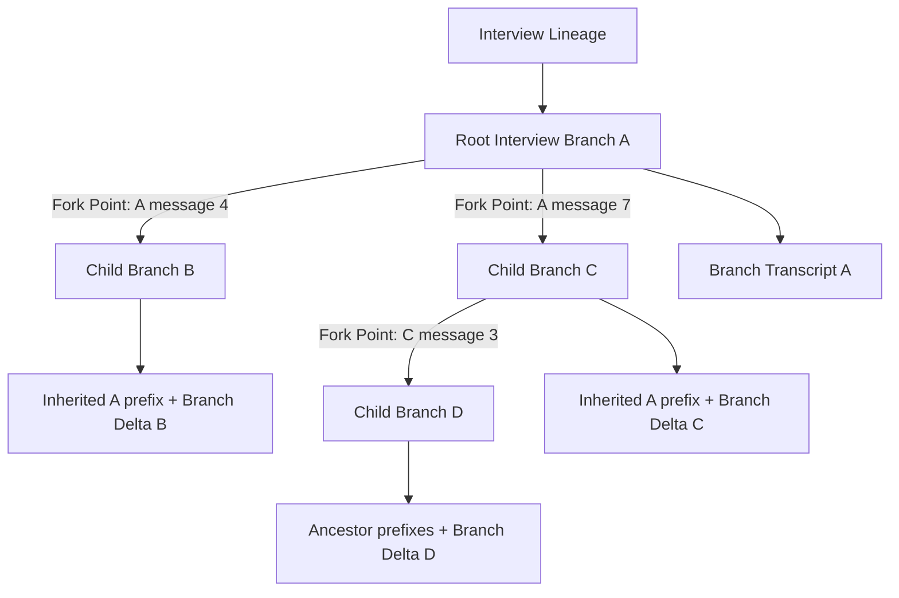
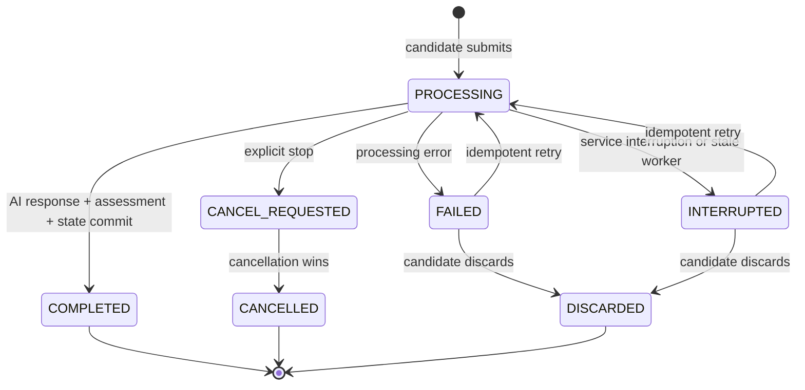

# Interview History, Resume, and Replay Design

Status: accepted

Confirmed: 2026-07-23

This document consolidates the decisions made for replacing fake Flutter interview history with real persisted data, reliably resuming unfinished interviews, and supporting message-anchored interview branching and replay.

## 1. Outcome

The system will provide:

1. A real interview-history list backed by Java/PostgreSQL data.
2. Reliable recovery of unfinished interview progress without inserting a fake candidate answer such as `继续`.
3. A read-only replay experience for completed branches and a resumable experience for active branches.
4. Explicit forks from eligible historical messages, with each fork becoming an independent child Interview Session.
5. A branch-level tree with a linear transcript for the focused branch.
6. Durable, idempotent, server-owned turn processing that survives page exits and excludes partial/error content from canonical history.
7. Conservative migration of every existing interview into the new lineage model.

## 2. Current Baseline and Gaps

The existing code already provides useful foundations:

- `GET /interviews`, `GET /interviews/incomplete`, `GET /interviews/{sessionId}`, and `POST /interviews/{sessionId}/resume` exist in the Java Interview Service.
- `InterviewService.getSessionHistory()` can load ordered `t_interview_message` rows.
- PostgreSQL stores `t_interview_session`, `t_interview_message`, `t_score_record`, and `t_evaluation`.
- The formal Python service can restore its current linear session model from SQLite.
- The current Compose configuration builds the formal Python `main:app` service rather than the old in-memory test stub.

The gaps are material:

- Flutter history and detail pages still contain static sample records.
- Flutter `resumeInterview()` clears messages and sends `继续` through the ordinary chat endpoint.
- Java does not expose a complete history/transcript contract.
- Messages do not persist enough semantics to distinguish questions, feedback, summaries, triggers, failures, or interrupted streams.
- A session is linear and has no lineage, parent, fork point, branch version, or branch delta.
- User answers are persisted before the AI turn is known to have completed, allowing partial turns.
- Java/Flutter SSE connection lifetime currently owns too much of the processing lifecycle.
- Python SQLite is still a competing recovery dependency rather than a rebuildable cache of Java/PostgreSQL business state.
- `init.sql` cannot upgrade a populated PostgreSQL database, and the backend currently has no versioned migration framework.

## 3. Domain Model

Canonical definitions live in [`../CONTEXT.md`](../CONTEXT.md).



Core entities:

- **Interview Lineage**: one history item containing a root branch and every descendant.
- **Interview Branch**: one linear Interview Session with independent status, progress, assessments, and final evaluation.
- **Fork Point**: the persisted message anchoring inherited context.
- **Owning Branch**: the branch on which a message was originally created.
- **Branch Delta**: data created specifically on a branch after its fork point.
- **Interview Turn**: candidate answer, complete AI response, assessment, and state transition committed atomically.
- **Turn Attempt**: durable processing attempt that may complete, fail, be interrupted, be cancelled, or be discarded.

## 4. Non-Negotiable Invariants

1. Java Interview Service and PostgreSQL remain the business authority.
2. Python runtime state must be rebuildable from a Java-provided branch snapshot.
3. Source branches and committed Business Messages are immutable.
4. A manual historical continuation always creates a child Interview Session.
5. Continuing the tail of an unfinished branch does not create a child.
6. Selecting a message does not create a branch; submitting a Branch Draft does.
7. Completed branches cannot be extended at their tail, but eligible historical messages may be forked.
8. A Lineage may contain multiple Active Branches.
9. A Lineage may run only one AI Turn Attempt at a time in the first release.
10. Partial streams, transport failures, and UI error text never become canonical Business Messages.
11. Every submission is idempotent and protected by Branch Version optimistic concurrency.
12. Inherited messages and assessments are referenced through ancestry, not copied into child rows.

## 5. Interaction Semantics

### 5.1 Open history

The history list shows one Lineage Summary per original interview.

- With completed branches: display and score-sort by the best completed branch score.
- Without completed branches: display the latest Active Branch stage and progress.
- Always display latest Business Activity and branch counts.
- Never average related branch scores.

Opening a lineage:

1. Focus the Active Branch with the latest Business Activity.
2. If none is active, focus the most recently completed branch.
3. Hydrate persisted state only; do not call the model or append messages.

### 5.2 Continue an active tail

If the focused branch ends in a completed AI prompt that expects a response, show the input box and submit a normal candidate answer to the same branch.

If a Turn Attempt is processing, show processing state and subscribe to its progress.

If a Turn Attempt failed or was interrupted, show Turn Recovery outside the transcript.

### 5.3 Fork from a candidate answer

1. Inherit context up to the AI prompt preceding the selected answer.
2. Pre-fill the old candidate answer as an editable Branch Draft.
3. Create no server branch while the draft is merely displayed.
4. On explicit submission, create the child session and process the new answer.
5. Do not inherit the selected answer's old assessment.

### 5.4 Fork from an AI message

1. The AI message must be complete and explicitly expect a candidate response.
2. Inherit context through that AI message.
3. Show an empty input box.
4. Create the child session only when the candidate submits an answer.

### 5.5 Fork from inherited content

The child attaches to the selected message's Owning Branch, not necessarily the currently Focused Branch. This keeps the Branch Tree aligned with the context actually inherited.

## 6. Message Semantics

The persisted message contract must add explicit semantics. Proposed values include:

```text
message_type:
  candidate_answer
  ai_question
  ai_feedback
  stage_transition
  final_summary
  system_trigger

delivery_status:
  completed
  interrupted
  failed

expects_response:
  true | false
```

Forkable messages are limited to:

- completed `candidate_answer` messages;
- completed AI prompts with `expects_response=true`.

Feedback, final summaries, system triggers, errors, and partial streams may be visible where appropriate but are not forkable.

## 7. Turn Processing State Model



Rules:

- Candidate answer text is durably preserved as soon as the Turn Attempt is created.
- AI chunks may be streamed and optionally cached for progress display but are not Business Messages until completion.
- Completion atomically commits candidate message, AI message, assessment, stage, counters, branch version, and Business Activity.
- Page navigation or network loss does not cancel processing.
- Explicit cancellation prevents late results from committing.
- Reconnection reads status by `turnId` and reattaches to progress if still running.
- Failure recovery is presented outside the Branch Transcript.

## 8. Concurrency

Every submission includes:

- `turnId` or idempotency key;
- `expectedBranchVersion`;
- `expectedTailMessageId`.

The server rejects:

- a second turn on the same branch while one is processing;
- a submission based on a stale branch version;
- a second processing turn elsewhere in the same lineage while the Lineage Processing Slot is occupied.

The client preserves rejected answer text as a Branch Draft and offers refresh or explicit fork. It never silently overwrites history, queues model work, or creates a branch.

## 9. Assessment Semantics

For a child branch:

- Completed assessments strictly before the Fork Point are Inherited Assessments.
- The answer that starts the new path and every downstream answer are assessed again.
- Inherited assessments are not re-scored.
- The child creates its own final evaluation from inherited plus branch-owned assessments.
- The root and every child retain independent final reports.

Assessment records must link to the relevant turn, question message, and answer message so the fork boundary is deterministic.

## 10. Proposed PostgreSQL Model

### 10.1 New `t_interview_lineage`

Suggested fields:

| Field | Purpose |
|---|---|
| `id` | Lineage ID |
| `user_id` | Owner |
| `root_session_id` | Root branch |
| `last_business_activity_at` | History sort/focus support |
| `archived` | Soft visibility control |
| `created_at`, `updated_at` | Audit timestamps |

### 10.2 Extend `t_interview_session`

Suggested fields:

| Field | Purpose |
|---|---|
| `lineage_id` | Parent Lineage |
| `parent_session_id` | Parent branch, null for root |
| `fork_point_message_id` | Context boundary |
| `fork_trigger_message_id` | Message the user selected |
| `branch_label` | Default/generated display label |
| `branch_version` | Optimistic concurrency |
| `last_business_activity_at` | Default focus |
| `legacy_migrated` | Legacy classification/audit marker |

Existing session ID remains the branch ID. Existing status values may be retained initially, with application enums replacing magic numbers.

### 10.3 Extend `t_interview_message`

Suggested fields:

| Field | Purpose |
|---|---|
| `turn_id` | Owning Interview Turn |
| `message_type` | Business semantics |
| `expects_response` | AI prompt eligibility |
| `delivery_status` | Completed/interrupted/failed |
| `metadata` | Structured question/media data |

`session_id` remains the Owning Branch. Inherited messages are not duplicated.

### 10.4 New `t_interview_turn_attempt`

Suggested fields:

| Field | Purpose |
|---|---|
| `id` | Stable turn/idempotency identity |
| `lineage_id`, `session_id` | Processing scope |
| `expected_branch_version` | Stale-state guard |
| `expected_tail_message_id` | Tail guard |
| `candidate_answer` | Recoverable answer |
| `status` | Processing lifecycle |
| `retry_of_id` | Attempt relationship |
| `agent_run_id`, `request_id` | Trace correlation |
| `error_code`, `diagnostic_ref` | Sanitized recovery/diagnostic link |
| timestamps | Processing, completion, failure, cancellation |

Required database guards:

- unique idempotency identity;
- partial unique index allowing one `PROCESSING` attempt per lineage;
- foreign keys to lineage and branch;
- indexes for branch/status and lineage/status queries.

### 10.5 Assessment linkage

`t_score_record` must link to `turn_id`, question message, and answer message. Inherited assessment sets are derived from the immutable ancestor path and fork boundary; a child final evaluation records provenance of the contributing score records without duplicating the source scores.

## 11. Flyway Migration Strategy

The Interview Service owns migrations under:

```text
ai-interviewer-interview/src/main/resources/db/migration/
```

Required sequence:

1. Baseline the existing populated schema.
2. Add nullable lineage, branch, message-semantics, and turn-attempt structures.
3. Create one Lineage and root Legacy Branch mapping for every existing Session.
4. Backfill message semantics with deterministic rules.
5. Preserve original content, sequence, scores, and evaluations.
6. Mark ambiguous legacy messages visible but non-forkable.
7. Add indexes and uniqueness constraints.
8. Validate counts, references, roots, and orphan absence.
9. Tighten non-null constraints only after successful backfill.

`init.sql` remains synchronized for fresh local environments but is never treated as a populated-database upgrade path.

## 12. Java API Shape

Proposed authenticated endpoints:

```text
GET  /interviews/lineages
GET  /interviews/lineages/{lineageId}
GET  /interviews/lineages/{lineageId}/tree
GET  /interviews/branches/{branchId}
GET  /interviews/branches/{branchId}/transcript

POST /interviews/branches/{branchId}/turn-attempts
GET  /interviews/turn-attempts/{turnId}
GET  /interviews/turn-attempts/{turnId}/events
POST /interviews/turn-attempts/{turnId}/retry
POST /interviews/turn-attempts/{turnId}/cancel
POST /interviews/turn-attempts/{turnId}/discard

POST /interviews/forks
```

`POST /interviews/forks` receives the selected message, candidate answer, expected source state, and idempotency key; it creates the child session and first Turn Attempt atomically. It never creates an empty branch.

The old `/interviews/{sessionId}/resume` contract remains temporarily compatible but must stop producing new AI content merely to open history. New Flutter code uses branch/transcript and turn-attempt APIs.

## 13. Python Boundary

Java sends an explicit branch snapshot containing at least:

- Java branch/session ID and lineage ID;
- stage and counters;
- resume and job context;
- composed Business Message history;
- question pools and current prompt state;
- owned and inherited assessment context;
- `turnId`, `agentRunId`, and request correlation.

Python may cache or persist runtime state, but that state is disposable and rebuildable. LangGraph Agent Checkpoints remain single-turn execution checkpoints and do not become Interview Session authority.

The durable response returns a complete `post_turn_state` candidate containing the resulting stage/status, project count/target, follow-up count, and both remaining question pools. Python does not write Java business state directly. Java validates this result and `TurnCommitService` atomically commits it together with the canonical answer/message/score and Branch Version increment. The next turn snapshot is therefore composed from the prior Java commit, not from Python cache state.

Python also maintains a local restart-safe `turn_id` ledger. First ownership is an atomic SQLite insert; stale ownership replacement is a compare-and-swap on the observed owner and timestamp. An exact duplicate replays the stored structured result, while a changed snapshot or candidate answer is rejected. This ledger is an execution idempotency cache, not interview business authority.

## 14. Flutter Experience

### History page

- Replace static records with paged `LineageSummary` data.
- Preserve time and score sorting with the confirmed semantics.
- Add status filtering and empty/error/loading states.
- Display best completed score or latest active progress.

### Replay page

- Desktop/web: Branch Tree and Branch Transcript split view.
- Mobile: transcript-first layout with branch tree drawer/sheet.
- Highlight inherited prefix, Fork Point, and branch-owned delta.
- Show actions only on Forkable Messages.
- Completed branch: no tail composer unless a fork draft is explicitly prepared.
- Active branch: composer only when the tail expects a candidate response.
- Processing branch: status and reattachment, no second submission.
- Failed/interrupted branch: Turn Recovery card outside transcript.

## 15. Legacy Acceptance Anchor

The real local session `ef3d58eb84c74358a4b55dd09ff635b2` is a mandatory Phase 1 manual acceptance anchor.

Expected proof:

1. It appears as a Legacy Branch in real history.
2. Its six known Business Messages retain order and content.
3. No prior transport/UI error is shown as a Business Message.
4. Opening the transcript creates no model request or message.
5. It focuses the last valid AI question.
6. A new answer creates exactly one completed Interview Turn.
7. No fake `继续`, duplicate answer, duplicate score, or double stage advancement is stored.
8. Java and Python service restart does not prevent later reload and continuation.

A redacted structural fixture must reproduce this scenario for repeatable automated regression. The live local row itself is not committed as test data.

## 16. Security and Ownership

- Every lineage, branch, transcript, message, turn, fork, and evaluation request is scoped to the authenticated `X-User-Id`.
- The server resolves Owning Branch and ancestry; clients cannot supply trusted ownership links.
- Fork requests validate that the selected message belongs to a lineage owned by the caller and is forkable.
- Error details returned to Flutter are sanitized; diagnostic references remain server-side.
- Referenced ancestor history is soft-hidden or archived, never physically deleted while descendants depend on it.

## 17. Non-Goals for the First Release

- No automatic branching on conflict.
- No automatic queue of model work.
- No branch-score averaging.
- No use of LangGraph checkpoints as business-session state.
- No physical deletion of referenced history.
- No exposure of diagnostic errors as transcript messages.
- No user-visible replay controls before their full backend guarantees pass.

## 18. Decision Records

This design is backed by ADRs 0001 and 0012 through 0024 under [`adr/`](adr/).
