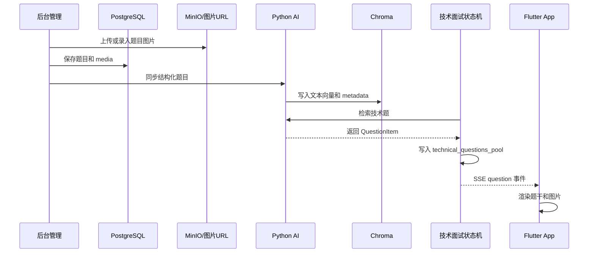

# 技术面试图文题实施计划

> 用途：这份文档用于指导“技术面试题支持图文展示”的完整改造。范围覆盖后台导入题库、题目存储、向量同步、技术题生成/检索、SSE 返回、Flutter 面试页面展示和验收。

## 1. 结论

推荐采用 **结构化图文题目方案**。

核心变化是把技术题从纯字符串：

```text
technical_questions_pool: List[str]
```

升级为结构化对象：

```text
technical_questions_pool: List[QuestionItem]
```

每道题保留题干、图片、标题、答案参考、题型、难度、技能领域、标签等信息。向量检索仍以文本为主，面试展示则使用结构化题目对象渲染图文。

## 2. 当前问题

技术面试过程中，题目只显示文字。

典型现象：

```text
图 10-17 getToken_access_limit.lua 脚本和 rate_limiter.lua 脚本关系
```

当前系统只把这句话当成题干文本展示，没有真实图片。

### 2.1 已确认事实

| 链路 | 当前实现 | 问题 |
|---|---|---|
| 后台题库表 | `t_question_bank` 以 `question_text`、`answer_reference`、`question_type` 为主 | 没有题目图片或附件结构 |
| 题库导入 | CSV 固定表头只有文本字段 | 图片 URL 或内嵌图片无法进入题库 |
| PDF/DOCX 导入 | 主要抽取文本 | 图片不会绑定到题目 |
| Python 向量同步 | 同步结构化文本字段到 Chroma | 图片信息不会进入 Python 侧 |
| 技术题池 | `technical_questions_pool` 是字符串列表 | 题目只能是纯文本 |
| SSE 返回 | `chunk` 和 `next_question` 都是字符串 | 前端拿不到图片 |
| Flutter 消息 | `ChatMessage.content` 是字符串 | 气泡只能 `Text(...)` 渲染 |

### 2.2 根因

根因不是前端少写了一个图片组件，而是整条技术题链路没有“题目媒体资源”这个概念。

需要改的是端到端数据模型：

```text
题库导入
  -> 后台题库保存
  -> 图片资源存储
  -> 向量库同步
  -> 技术题检索
  -> 技术题池持久化
  -> SSE 返回题目
  -> Flutter 渲染题目
```

## 3. 目标范围

### 3.1 第一期目标

第一期目标是打通图文题主链路。

必须支持：

1. 后台题库题目可以绑定图片。
2. CSV 或 Markdown 导入时可以带图片 URL。
3. 图片 URL 可以同步到 Python AI 服务。
4. 技术题检索后返回结构化题目对象。
5. 技术面试 SSE 可以下发图文题。
6. Flutter 技术面试页面可以展示题干和图片。
7. 旧的纯文本题目继续可用。

暂不强制支持：

1. PDF 内嵌图片自动抽取。
2. DOCX 内嵌图片自动抽取。
3. 图片内容向量化。
4. 图片 OCR。
5. 图片自动理解或图像模型评分。

### 3.2 第二期目标

第二期再补复杂导入和增强能力。

可选支持：

1. DOCX 内嵌图片抽取并绑定题目。
2. 规范 PDF 模板中的图片抽取。
3. 图片 OCR 后参与检索。
4. 图片预览、放大、下载。
5. 后台图片上传到 MinIO。
6. 面试历史记录中的图片快照归档。

## 4. 推荐方案

### 4.1 方案选择

| 方案 | 说明 | 是否推荐 |
|---|---|---|
| 只在前端识别图片 URL | 后端仍返回字符串，前端解析 Markdown 或 URL | 不推荐，链路不完整 |
| 题干 Markdown 化 | 题干支持 `` | 可作为过渡方案 |
| 结构化图文题目 | 题目对象包含 `text` 和 `media[]` | 推荐 |
| 整题截图化 | 把整道题作为图片展示 | 只适合特殊题型，不适合作为主线 |

### 4.2 推荐主线

采用结构化图文题目。

题目结构示例：

```json
{
  "id": "123",
  "text": "请结合下图说明 getToken_access_limit.lua 和 rate_limiter.lua 的关系。",
  "question_type": "TECHNICAL",
  "difficulty": "MEDIUM",
  "skill_area": "Redis",
  "tags": ["Redis", "限流", "Lua"],
  "media": [
    {
      "type": "image",
      "url": "http://localhost:19000/ai-interviewer/questions/123/figure-10-17.png",
      "caption": "图 10-17 getToken_access_limit.lua 脚本和 rate_limiter.lua 脚本关系",
      "alt": "Redis 限流 Lua 脚本调用关系图"
    }
  ],
  "answer_reference": "getToken_access_limit.lua 负责请求入口和令牌消费，rate_limiter.lua 负责底层限流计算。"
}
```

## 5. 端到端流程

### 5.1 目标流程



### 5.2 技术面试运行流程

```text
候选人回答最后一个项目问题
  -> Python 切换到 technical_qna
  -> 检查技术题池是否初始化
  -> 检索结构化技术题列表
  -> 第一题写入 history
  -> 剩余题写入 technical_questions_pool
  -> SSE 下发 question 事件
  -> Flutter 展示文字和图片
  -> 候选人回答
  -> Python 用 question.text 评分
  -> 继续下发下一道结构化题
```

## 6. 数据模型设计

### 6.1 后台数据库

推荐新增题目媒体表。

```sql
CREATE TABLE IF NOT EXISTS t_question_media (
    id BIGSERIAL PRIMARY KEY,
    question_id BIGINT NOT NULL,
    media_type VARCHAR(30) NOT NULL,
    media_url TEXT NOT NULL,
    caption TEXT,
    alt_text TEXT,
    sort_order INTEGER NOT NULL DEFAULT 0,
    created_by BIGINT,
    created_at TIMESTAMPTZ NOT NULL DEFAULT CURRENT_TIMESTAMP,
    updated_at TIMESTAMPTZ NOT NULL DEFAULT CURRENT_TIMESTAMP,
    deleted_at TIMESTAMPTZ,
    CONSTRAINT fk_question_media_question
        FOREIGN KEY (question_id) REFERENCES t_question_bank(id)
);

CREATE INDEX IF NOT EXISTS idx_question_media_question_id
    ON t_question_media(question_id);
```

### 6.2 备用简化方案

如果要更快落地，可以先在 `t_question_bank` 中加 JSON 字段。

```sql
ALTER TABLE t_question_bank
ADD COLUMN IF NOT EXISTS content_format VARCHAR(30) NOT NULL DEFAULT 'PLAIN_TEXT',
ADD COLUMN IF NOT EXISTS media JSONB NOT NULL DEFAULT '[]'::jsonb;
```

对比：

| 方式 | 优点 | 缺点 | 建议 |
|---|---|---|---|
| 独立媒体表 | 易查询、易排序、易审计、易扩展 | 改动略多 | 推荐 |
| JSON 字段 | 落地快 | 后续上传、删除、排序、统计不方便 | 可作 MVP |

### 6.3 Python 题目对象

建议新增内部模型。

```python
class QuestionMedia(BaseModel):
    type: str
    url: str
    caption: str | None = None
    alt: str | None = None


class QuestionItem(BaseModel):
    id: str | None = None
    text: str
    question_type: str | None = None
    difficulty: str | None = None
    skill_area: str | None = None
    tags: list[str] = []
    media: list[QuestionMedia] = []
    answer_reference: str | None = None
```

### 6.4 会话持久化

技术题池要从字符串数组升级为对象数组。

旧结构：

```json
[
  "请解释 synchronized 和 Lock 的区别？"
]
```

新结构：

```json
[
  {
    "id": "123",
    "text": "请结合下图说明两个 Lua 脚本的关系。",
    "media": [
      {
        "type": "image",
        "url": "http://localhost:19000/ai-interviewer/questions/123/figure-10-17.png",
        "caption": "图 10-17 getToken_access_limit.lua 脚本和 rate_limiter.lua 脚本关系"
      }
    ]
  }
]
```

兼容要求：

1. 读取旧数据时，如果数组元素是字符串，自动转换为 `QuestionItem(text=item)`。
2. 写入新数据时，统一写对象。
3. 评分记录中保留 `question_text`，同时可追加 `question_snapshot`。

## 7. 接口协议设计

### 7.1 Java Admin 同步到 Python

当前同步接口继续保留。

需要扩展请求字段：

```json
{
  "questions": [
    {
      "id": 123,
      "question_text": "请结合下图说明两个 Lua 脚本关系。",
      "answer_reference": "参考答案...",
      "question_type": "TECHNICAL",
      "difficulty": "MEDIUM",
      "tags": ["Redis", "Lua"],
      "skill_area": "Redis",
      "media": [
        {
          "type": "image",
          "url": "http://localhost:19000/ai-interviewer/questions/123/figure-10-17.png",
          "caption": "图 10-17 getToken_access_limit.lua 脚本和 rate_limiter.lua 脚本关系",
          "alt": "Redis 限流 Lua 脚本调用关系图"
        }
      ]
    }
  ]
}
```

### 7.2 Python SSE 返回

推荐新增 `question` 事件。

```text
event: question
data: {
  "question": {
    "id": "123",
    "text": "请结合下图说明两个 Lua 脚本的关系。",
    "media": [
      {
        "type": "image",
        "url": "http://localhost:19000/ai-interviewer/questions/123/figure-10-17.png",
        "caption": "图 10-17 getToken_access_limit.lua 脚本和 rate_limiter.lua 脚本关系"
      }
    ]
  },
  "next_stage": "technical_qna"
}
```

继续保留原有 `chunk` 和 `result`。

兼容策略：

| 前端版本 | 行为 |
|---|---|
| 旧前端 | 继续读取 `chunk` 展示纯文本 |
| 新前端 | 优先读取 `question` 展示图文 |
| 无图片题 | `question.media = []`，按纯文本展示 |

### 7.3 Java Interview SSE 代理

Java `ai-interviewer-interview` 服务当前主要透传 Python SSE。

要求：

1. 不吞掉新增的 `question` 事件。
2. 不把 `question` 事件误合并成纯文本。
3. 网关保持 `text/event-stream`。
4. 移动端接口路径保持不变。

## 8. 导入设计

### 8.1 CSV 导入

第一期建议扩展 CSV 表头。

```csv
question_text,answer_reference,question_type,difficulty,tags,skill_area,job_id,status,media_urls,media_captions
请结合下图说明两个 Lua 脚本关系,参考答案...,TECHNICAL,MEDIUM,Redis;Lua,Redis,,1,https://example.com/figure-10-17.png,图 10-17 getToken_access_limit.lua 脚本和 rate_limiter.lua 脚本关系
```

解析规则：

1. `media_urls` 支持多个 URL，用 `;` 分隔。
2. `media_captions` 支持多个标题，用 `;` 分隔。
3. URL 数量和 caption 数量不一致时，缺失 caption 留空。
4. 只允许 `http://`、`https://` 或系统 MinIO 域名。
5. 导入成功后写入 `t_question_media`。

### 8.2 Markdown 导入

支持 Markdown 图片语法。

```markdown
题目：请结合下图说明两个 Lua 脚本关系。


参考答案：getToken_access_limit.lua 是入口脚本，rate_limiter.lua 是限流判断脚本。
题型：TECHNICAL
难度：MEDIUM
技能领域：Redis
标签：Redis;Lua;限流
```

解析规则：

1. `` 解析为 `media`。
2. 图片语法不进入向量正文。
3. caption 可以拼入检索文本，帮助召回。
4. 非图片 Markdown 仍按文本题处理。

### 8.3 PDF/DOCX 导入

第二期处理。

建议先不承诺任意 PDF/DOCX 自动绑定图片，因为非结构化文档里的图片和题目关系不稳定。

第二期可支持规范模板：

```text
题目：请结合下图说明两个 Lua 脚本关系。
图片：figure-10-17.png
图注：图 10-17 getToken_access_limit.lua 脚本和 rate_limiter.lua 脚本关系
参考答案：...
```

## 9. 检索与生成设计

### 9.1 向量库写入

Chroma 的 `page_content` 仍以文本为主。

建议拼接：

```text
请结合下图说明两个 Lua 脚本关系。
图注：图 10-17 getToken_access_limit.lua 脚本和 rate_limiter.lua 脚本关系
参考答案：...
题型：TECHNICAL
难度：MEDIUM
技能领域：Redis
标签：Redis、Lua、限流
```

Metadata 保存结构化字段：

```json
{
  "source": "admin-question-bank",
  "question_id": "123",
  "question_type": "TECHNICAL",
  "difficulty": "MEDIUM",
  "skill_area": "Redis",
  "tags": "Redis,Lua,限流",
  "media_json": "[{\"type\":\"image\",\"url\":\"...\",\"caption\":\"...\"}]"
}
```

### 9.2 检索返回

`QuestionBank.search_questions()` 应继续做：

```text
Chroma 向量召回
  + 本地关键词召回
  + RRF 融合
  + 元数据加权
```

但返回值要从 `Document` 或字符串转换为 `QuestionItem`。

建议新增方法：

```python
def search_question_items(...) -> list[QuestionItem]:
    ...
```

旧方法 `search_questions(...)` 可保留，减少回归风险。

### 9.3 技术题选择

`select_technical_questions()` 返回结构化题。

评分时使用：

```python
current_question.text
```

展示时使用：

```python
current_question.text
current_question.media
```

## 10. 前端展示设计

### 10.1 消息模型

Flutter `ChatMessage` 建议增加媒体字段。

```dart
class ChatMessage {
  final bool isAI;
  final String content;
  final String time;
  final List<QuestionMedia> media;
}

class QuestionMedia {
  final String type;
  final String url;
  final String? caption;
  final String? alt;
}
```

### 10.2 气泡展示

AI 消息展示顺序：

1. 题干文字。
2. 图片卡片。
3. 图片 caption。
4. 图片加载失败占位。

图片加载建议：

1. 使用圆角卡片。
2. 限制最大高度，避免撑满屏幕。
3. 点击后进入图片预览。
4. 加载失败时展示“图片加载失败，请稍后重试”。

### 10.3 SSE 事件处理

处理顺序：

1. 收到 `question` 事件时创建结构化 AI 消息。
2. 如果没有 `question` 事件，继续使用 `chunk` 拼接文本。
3. 对同一道题避免重复添加消息。
4. `done` 事件只负责结束流状态。

## 11. 代码改造清单

### 11.1 后台 Admin

涉及模块：

```text
ai_interviewer_admin/
```

主要任务：

1. 新增 `t_question_media` 迁移。
2. 新增 `QuestionMedia` 实体和 Mapper。
3. `QuestionBankItem` 增加 `media` 字段。
4. 题目创建、更新、详情、列表接口返回媒体信息。
5. CSV 导入支持 `media_urls` 和 `media_captions`。
6. Markdown 导入解析 ``。
7. 向量同步请求增加 `media` 字段。
8. 补充单元测试和导入测试。

### 11.2 Python AI

涉及模块：

```text
ai_interviewer/
```

主要任务：

1. 新增 `QuestionItem` 和 `QuestionMedia` schema。
2. Admin 同步接口接收 `media`。
3. Chroma metadata 保存 `media_json`。
4. 检索结果转换为 `QuestionItem`。
5. 技术题池从字符串兼容升级为对象。
6. 当前问题记录支持结构化题。
7. SSE 新增 `question` 事件。
8. `resume` 恢复会话时返回当前图文题。
9. 保留纯文本题兼容逻辑。

### 11.3 Java Interview 服务

涉及模块：

```text
ai_interview_backend/ai-interviewer-interview/
ai_interview_backend/ai-interviewer-gateway/
```

主要任务：

1. 确认 SSE 代理透传新增事件。
2. 确认网关不缓冲 SSE。
3. 如有消息持久化字段限制，补充题目快照字段。
4. 补充最小 SSE 代理测试。

### 11.4 Flutter App

涉及模块：

```text
ai_interviewer_front/
```

主要任务：

1. `ChatMessage` 增加 `media`。
2. `InterviewService` 解析 `question` 事件。
3. `InterviewChatPage` 渲染图片卡片。
4. 图片加载失败兜底。
5. 图片点击预览。
6. 旧 `chunk` 文本流保持兼容。

### 11.5 后台管理前端

涉及模块：

```text
ai_interviewer_admin_front/
```

主要任务：

1. 题目创建/编辑页面支持图片 URL。
2. 题目详情页展示图片。
3. 导入模板说明增加图片列。
4. 导入批次错误信息展示图片 URL 校验错误。
5. 后续再做本地图片上传。

## 12. 分阶段实施计划

### 阶段一：协议和模型

目标：

1. 定义 `QuestionItem`。
2. 定义 `QuestionMedia`。
3. 明确 SSE `question` 事件。
4. 保留旧纯文本兼容。

验收：

1. 无图片题仍正常提问。
2. 模拟图文题可以通过接口返回结构化数据。

### 阶段二：后台题库和同步

目标：

1. 后台题目支持图片 URL。
2. CSV/Markdown 导入支持图片。
3. 同步到 Python 时带上 `media`。

验收：

1. 后台导入一条带图片 URL 的题目。
2. 审核/上架后 Python Chroma metadata 中能看到 `media_json`。
3. 下架/删除后向量库同步删除正常。

### 阶段三：Python 技术面试链路

目标：

1. 检索返回 `QuestionItem`。
2. 技术题池保存结构化对象。
3. SSE 下发 `question` 事件。
4. 恢复会话能找回图文题。

验收：

1. 进入 `technical_qna` 时直接发出第一道图文题。
2. 候选人回答后能继续下一题。
3. 评分使用题干文本，不受图片字段影响。
4. 面试历史中能保留题目图片快照。

### 阶段四：Flutter 展示

目标：

1. 面试聊天页展示图片。
2. 图片可预览。
3. 图片加载失败有兜底。
4. 旧文本流不回归。

验收：

1. 截图中的“图 10-17”类题目能展示真实图片。
2. 没有图片的题目仍按原样展示。
3. SSE 流式文字和结构化题目不会重复显示。

### 阶段五：完善和回归

目标：

1. 补充接口文档。
2. 补充导入模板。
3. 补充自动化测试。
4. 做端到端手动验收。

验收：

1. 新旧题库数据都可用。
2. 面试流程不会跳过技术题。
3. 图文题在移动端和 Web 端显示正常。

## 13. 验收清单

### 13.1 数据准备

准备一条图文技术题。

```text
题目：请结合下图说明 getToken_access_limit.lua 和 rate_limiter.lua 的关系。
图片：https://example.com/figure-10-17.png
图注：图 10-17 getToken_access_limit.lua 脚本和 rate_limiter.lua 脚本关系
参考答案：getToken_access_limit.lua 是入口脚本，rate_limiter.lua 是底层限流判断脚本。
题型：TECHNICAL
难度：MEDIUM
技能领域：Redis
标签：Redis;Lua;限流
```

### 13.2 后台验收

1. 导入成功。
2. 题目详情能看到图片 URL 和图注。
3. 审核通过后向量同步成功。
4. 同步失败时有错误信息。

### 13.3 Python 验收

1. `GET /interview/questions/count` 数量正常。
2. 搜索 Redis/Lua/限流相关内容能召回图文题。
3. 检索结果包含 `media`。
4. 技术题池保存结构化题目。

### 13.4 面试流程验收

1. 项目问答结束后进入 `technical_qna`。
2. 系统直接下发第一道技术题。
3. 第一道技术题包含图片。
4. 候选人回答后正常评分。
5. 下一题正常继续。
6. 技术题全部回答后才结束。

### 13.5 Flutter 验收

1. AI 气泡展示题干。
2. AI 气泡展示图片。
3. 图片下方展示 caption。
4. 点击图片可预览。
5. 图片加载失败有占位。
6. 纯文本题不受影响。

## 14. 测试建议

### 14.1 后台 Admin 测试

建议补充：

1. CSV 带单张图片导入。
2. CSV 带多张图片导入。
3. Markdown 图片语法导入。
4. 图片 URL 非法时导入失败。
5. 题目更新图片后向量状态变为 `PENDING`。
6. 下架题目后删除 Python 向量。

### 14.2 Python 测试

建议补充：

1. Admin 同步接口接收 `media`。
2. `media_json` 写入 Chroma metadata。
3. 搜索结果转换为 `QuestionItem`。
4. 旧字符串题池兼容读取。
5. SSE `question` 事件格式正确。
6. 恢复会话返回图文题。

### 14.3 Flutter 测试

建议补充：

1. `question` 事件解析测试。
2. 无图片消息渲染测试。
3. 单图消息渲染测试。
4. 多图消息渲染测试。
5. 图片加载失败 UI 测试。

## 15. 风险与规避

| 风险 | 影响 | 规避 |
|---|---|---|
| 只改前端导致链路断层 | 后续导入和检索仍无图片 | 先定义结构化题目协议 |
| PDF/DOCX 图片抽取复杂 | 第一阶段延期 | 第一阶段只做 URL 和 Markdown 图片 |
| 图片 URL 失效 | 面试时图片加载失败 | 图片上传到 MinIO，保留加载失败占位 |
| SSE 新事件影响旧前端 | 旧版本解析异常 | 保留 `chunk` 和 `result`，新增事件不替代旧事件 |
| 技术题池新旧数据不兼容 | 旧会话恢复失败 | 读取时字符串自动转对象 |
| 向量检索误把 URL 当正文 | 检索质量下降 | URL 不进入 `page_content`，只进 metadata |
| 图片过大影响移动端 | 页面卡顿 | 前端限制尺寸，后端限制上传大小 |

## 16. 推荐落地顺序

推荐按以下顺序实现：

1. 先做协议和 Python/Flutter 最小闭环。
2. 再做后台题库媒体表和 CSV/Markdown 导入。
3. 最后做 DOCX/PDF 图片抽取和图片上传增强。

最小闭环可以先用一条手工构造的图文题验证：

```text
Python mock QuestionItem
  -> SSE question
  -> Flutter 展示图文
```

闭环跑通后，再接后台真实导入和同步。

## 17. 相关文档

- [技术面试环节修复背景上下文](./TECHNICAL_INTERVIEW_FIX_CONTEXT.md)
- [技术题检索方案与当前落地背景](./QUESTION_RETRIEVAL_STRATEGY_CONTEXT.md)
- [AI Interviewer 架构设计文档](./ARCHITECTURE.md)
- [AI Interviewer 后台管理服务设计文档](./ADMIN_BACKEND_DESIGN.md)

## 18. 第一阶段落地状态

第一阶段已实现结构化图文题主链路：

1. 后台题库支持 `t_question_media` 保存图片 URL、图注和说明。
2. CSV 与 Markdown 导入支持图片 URL。
3. Admin 向 Python 同步题目时携带 `media`。
4. Python Chroma metadata 保存 `media_json`，检索返回 `QuestionItem`。
5. 技术题池从旧字符串兼容升级为结构化题目对象。
6. 技术面试 SSE 新增 `question` 事件，同时保留 `chunk` 和 `result` 兼容旧前端。
7. Java Interview SSE 代理识别 `question` 事件，并用题干文本维护 `lastQuestion` 与消息持久化。
8. Flutter 技术面试页展示题干、图片、图注和图片加载失败兜底。
9. Admin Web 新建题目支持填写图片 URL 和图注，题目列表展示图片数量。

未实现内容仍按第二期处理：

1. PDF/DOCX 内嵌图片抽取。
2. OCR 和图片向量化。
3. 本地图片上传到 MinIO。
4. 面试历史中的图片快照归档。
